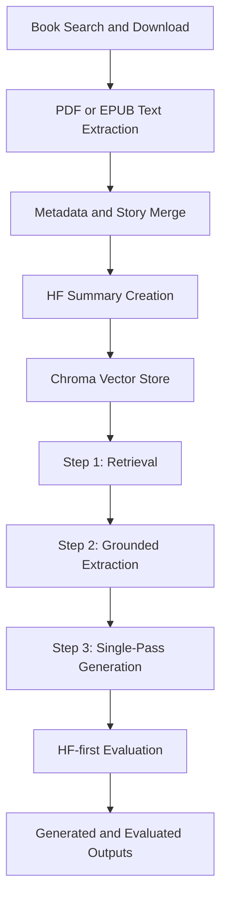

# StoryForge-RAG

Project docs are in `docs/README.md`.

# StoryForge-RAG

[](../../actions/workflows/tests.yml)

StoryForge-RAG is an end-to-end AI pipeline for book ingestion, metadata enrichment, vector search (Chroma), story generation, and automated quality evaluation via FastAPI.

Built as a practical AI/data engineering project to demonstrate system design, model trade-offs, and real-world reliability handling (rate limits, OOM, unstable generations).

## Architecture



## Reviewer Quick Path

If you are reviewing this project quickly, start here:

1. Read [`QUICK_DEMO.md`](./QUICK_DEMO.md) for the no-GPU/no-API-key validation path.
2. Run the lightweight tests:
   - `python -m pytest`
3. Check the GitHub Actions workflow in `.github/workflows/tests.yml`.
4. Read [`PROJECT_JOURNEY.md`](./PROJECT_JOURNEY.md) for the design decisions and trade-offs.
5. Read [`PROJECT_UPDATE_ROADMAP.md`](./PROJECT_UPDATE_ROADMAP.md) for the current improvement plan.
6. Read [`PRODUCTION_NOTES.md`](./PRODUCTION_NOTES.md) for production boundaries and next steps.

The lightweight tests focus on deterministic project logic and do not require Gemini, Hugging Face, Google Books, Chroma data, or a local generation model.

## Why It Matters

Most AI demos stop at generation. This project covers the full workflow:

- source intake and text extraction,
- data/metadata preparation,
- retrieval + generation,
- and automated evaluation.

## Project Journey

For the full development story, architecture decisions, trade-offs, and lessons learned, read:

- [`PROJECT_JOURNEY.md`](./PROJECT_JOURNEY.md)
- [`PROJECT_UPDATE_ROADMAP.md`](./PROJECT_UPDATE_ROADMAP.md)

## Highlights

- End-to-end pipeline from raw books to evaluated generated stories
- Mermaid architecture diagram and production notes for fast reviewer understanding
- Retrieval-first architecture with Chroma + embeddings
- Model selection based on quality/speed constraints (`Qwen2.5-7B` as practical local trade-off)
- Grounded generation pipeline: retrieval → grounded extraction → single-pass generation
- Prompt-split generation design in `prompts.yaml` (single-pass + grounded extraction templates)
- Generation modes: `FAST`, `THINKING`, and `SHORT`
- Optional per-layer temperature/top-p overrides in `setup.yaml`
- Prompt-budget-aware context truncation before generation
- Repetition controls (repetition/frequency/presence penalties + no-repeat ngram)
- Advanced decoding via `Generative_AI/penalty_processors.py` to reduce repetition loops while excluding common stopwords from penalty application
- Post-generation cleanup safeguards to trim malformed tails and degeneration artifacts
- Query–context alignment guardrails: if retrieved context does not match the query, Layer 1 fails closed with a structured "insufficient context" signal instead of extracting the wrong story
- Multi-story retrieval filtering: when retrieval returns multiple story blocks, context is sorted/filtered to the best matching story by query keyword overlap
- Grounding improvements: generation uses extracted facts as the source of truth instead of passing through a lossy summary-and-expansion chain
- Reliability work for real failures (API rate limits, GPU OOM, malformed outputs)
- Format-aware Archive download handling (`pdf` / `epub`) with cleaner file selection
- Duplicate-download protection by identifier to avoid redundant fetches
- Evaluation with Hugging Face first and Gemini fallback, with retry handling for transient API errors
- API groups: `/orchestration` (pipeline steps), `/create-eval` (generate/evaluate stories and summaries)
- `debug_layers/` scripts to run Layer 1–3 in isolation for debugging (see `debug_layers/README.md`)
- Lightweight pytest coverage for section parsing, metadata checks, and data merge behavior

## Grounded Story Generation

The generation path now keeps retrieval grounding while avoiding the old lossy middle stages:

1. **Step 1 — Retrieval:** Chroma retrieves the most relevant story context for the request.
2. **Step 2 — Grounded Extraction:** the model extracts concrete `Who/What/When/Where/Why/How` facts from retrieved context. If retrieved context has **zero keyword overlap** with the query, extraction fails closed with a structured **"insufficient context"** signal instead of guessing.
3. **Step 3 — Single-Pass Generation:** the final story is generated once from the grounded extraction, avoiding the extra summary compression and expansion pass that could drop facts or hallucinate.

If grounded extraction returns empty output, generation falls back to retrieval single-pass mode.

Enable/configure in `setup.yaml` (see `setup.example.yaml` for commented defaults):

- `Three_layer_generation` (legacy key name; now enables the grounded pipeline)
- `Story_generation_n_results`
- `Generation_mode_fast` / `Generation_mode_thinking` / `Generation_mode_short`
- `Generation_*_temperature` / `Generation_*_top_p` and optional `Layer1_*`, `Layer2_*`, `Layer3_*` overrides
- Single-pass and extraction token budgets (`Single_pass_*`, `Layer1_max_tokens`)
- `Min_generation_ratio`, penalties, `Model_max_prompt_tokens`

Related prompt templates live in `prompts.yaml` under `generation`:

- `full_story_system` / `full_story_user`
- `layer1_5w1h_system` / `layer1_5w1h_user`
- legacy/debug layer2/layer3 templates are still present for isolated debugging scripts

## What It Does

- Fetches public-domain books (Google Books + Archive.org)
- Downloads selected source formats (`pdf` / `epub`) from Archive when available
- Extracts text from PDF/EPUB sources
- Builds metadata + merged records for retrieval
- Creates/updates merged summaries with Hugging Face (`/data/summaries_create` and `/data/summaries_create_and_check`)
- Normalizes merged `metadatas.Summary` formatting after summarization (apostrophes/quotes/punctuation spacing, minor OCR noise cleanup)
- Ingests records into Chroma vector store
- Generates stories from retrieved context (retrieval single-pass or grounded extraction + single-pass generation)
- Evaluates generated outputs with rubric-based scoring

## Tech Stack

- Python, FastAPI, Pydantic
- ChromaDB, sentence-transformers
- Transformers (local generation model)
- Hugging Face Inference API (summarization + primary evaluation) + Gemini API fallback (evaluation)

## Project Structure

- `API/` - FastAPI routes (`orchestration`, `create-eval`, data, etc.)
- `Orchestrator/` - Pipeline orchestration and step control
- `Book_search/` - Search/download + extraction entry points
- `Data/` - Metadata and merge logic
- `Vector_Store/` - Chroma ingestion/query utilities
- `Generative_AI/` - `config`, `modes` (enums + sampling), `inference` (model + `truncate_context`), `generation` (retrieval + layers + entrypoints), `generative_ai` facade, penalty processors, flow choice
- `Evaluation/` - Automated scoring and feedback
- `scripts/` - Utility scripts for CUDA checks, Gemini model listing, and merged-data validation
- `debug_layers/` - Optional layer-by-layer CLI debugging

## Quick Start

1. Install dependencies:
   - `pip install -r requirements.txt`
2. Create local config:
   - copy `setup.example.yaml` to `setup.yaml`
   - use **`setup.yaml` for day-to-day runs** (local paths and keys; this file is gitignored)
   - keep **`setup.example.yaml` in sync when you add or rename config keys** you want in the repo for collaborators and fresh clones
3. Start API:
   - `python main.py`
4. Open docs:
   - `http://localhost:8000/docs`

## Tests

Run:

- `python -m pytest`

The current lightweight suite covers:

- Shared config loading with `setup.example.yaml` fallback (`storyforge_config.py`)
- Hugging Face-first evaluation provider selection and Gemini fallback (`Evaluation/evaluation.py`)
- Retrieval evaluation metrics for top-k accuracy and fact coverage (`Evaluation/retrieval_eval.py`)
- Layer 2 section parsing (`Generative_AI/section_parse.py`)
- Metadata summary validation (`Data/metadata.py`)
- Story/metadata merge behavior (`Data/data_merge.py`)

These tests use temporary directories and avoid external services, local model loading, and runtime data folders.

CI:

- `.github/workflows/tests.yml` runs the lightweight pytest suite on push, pull request, and manual dispatch.
- The workflow installs only lightweight test dependencies because the current tests intentionally avoid GPU/model/API dependencies.

## Configuration

Runtime configuration is loaded through `storyforge_config.py`.

- Day-to-day runs should still use local `setup.yaml` for machine-specific paths and keys.
- If `setup.yaml` is missing, import-time configuration falls back to `setup.example.yaml` so lightweight tests and fresh-clone review do not fail immediately.
- API keys can be supplied through environment variables or `.env` / `.env.local`; local secret files remain gitignored.
- Evaluation provider priority is controlled by `Evaluation_provider_priority` in `setup.yaml`; the default template tries `huggingface` before `gemini`.
- Hugging Face evaluation uses `HF_evaluation_model` and the same HF token settings as summarization (`STORYFORGE_HF_API_KEY`, `HUGGINGFACE_API_KEY`, `HF_TOKEN`, or `facehugging_api`).
- The main HF evaluation knobs are `HF_evaluation_model`, `HF_evaluation_max_new_tokens`, and `HF_evaluation_temperature`.

## Main Flow

1. Search/download book files
2. Extract text from book files
3. Create metadata templates
4. Merge metadata + documents
5. Create missing merged summaries with Hugging Face (`/data/summaries_create`)
6. Ingest into Chroma
7. Generate story (retrieval → grounded extraction → single-pass generation)
8. Evaluate generated story/summary

For local validation after data updates, run the data path in this order:

1. `POST /data/merged`
2. `POST /data/summaries_create` (or `POST /data/summaries_create_and_check`)
   - After summaries are created, the pipeline runs a formatting cleanup pass to keep `Data_Merged/*.json` summaries consistent.
3. `POST /orchestration/run_step` with `{"step":"4_ingest","title":"manual_step"}`

## Retrieval Evaluation

`Evaluation/retrieval_eval.py` measures whether vector search returns the expected story for a query.

It reports:

- top-1 accuracy
- top-k accuracy, default `k=3`
- expected title rank
- expected fact coverage across retrieved context

Example:

```bash
python -m Evaluation.retrieval_eval --cases Evaluation/retrieval_eval_cases.example.json --output Evaluation/retrieval_eval_report.json --k 3
```

The included `Evaluation/retrieval_eval_cases.example.json` is a small template. Replace or extend it with project-specific queries and expected facts after ingesting your real corpus.

`Evaluation/retrieval_eval_report.example.json` shows the expected report shape using illustrative sample results.

## Who This Is For

- Recruiters and hiring managers reviewing applied AI/data engineering projects
- Engineers who want a concrete reference for retrieval + generation + evaluation pipelines

## Current status

With the current setup, generated stories can still be **incomplete** (cut short or thin in places), and I am actively debugging and tuning that. Recent reliability upgrades added **fail-closed query–context alignment**, **multi-story context filtering**, and a grounded extraction step before final generation, replacing the older summary-and-expansion chain that could lose plot beats or drift. My main working hypothesis remains **retrieval coverage**: the Chroma index built from what I have ingested so far only exposes **about 47 records** to RAG, which is small for diverse long-form conditioning—so weak or repetitive context upstream may be part of the problem, alongside token limits and generation settings. I am expanding ingestion and revisiting chunking/metadata to improve what retrieval returns.

## Generation mode and data reset update

I added a new generation mode to control whether output should be based on a **single** story source or a **series** source:

- if the request is `single`, retrieval only pulls records tagged as single from the vector store,
- if the request is `series`, retrieval only pulls records tagged as series from the vector store.

Because older indexed data did not consistently store this single/series field, I removed the existing vector-store data and re-ingested it after validation. I also performed a double-check pass to make sure the saved data is now correct and consistent for this filter behavior.

## Security Notes

- Do not commit `setup.yaml` (local secrets and machine-specific paths).
- Commit `setup.example.yaml` as the safe template: when you ship new settings, mirror them there so others can copy it to `setup.yaml`.

## License

MIT
