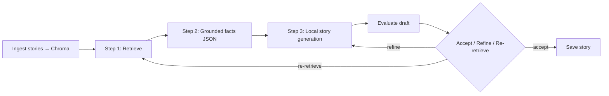

# Project Journey: StoryForge-RAG

I built **StoryForge-RAG** around one question:

**Can I ship an end-to-end pipeline that turns book/story sources into grounded, evaluated narratives—with honest quality limits on consumer GPU hardware?**

This document explains how the system evolved: what I tried, what broke, what I fixed, and where it stands today.

I used AI assistants for research and debugging speed; architecture and implementation decisions are mine.

---

## Current system (2026)

The public repo (`src/storyforge/`) runs a **grounded 3-step RAG** pipeline plus an optional **agentic loop**.

| Stage | What it does | Typical model |
|--------|----------------|----------------|
| **Step 1** | Chroma search + optional cross-encoder rerank; diverse story titles | `BAAI/bge-base-en-v1.5` embeddings |
| **Step 2** | Extract grounded facts (JSON with chunk ids) | HF router `Qwen2.5-7B` (API) |
| **Step 3** | Write a fixed **5-section** story from facts only | Local `Qwen2.5-7B` (GPU) |
| **Agentic loop** | Score each draft; refine incomplete stories or widen retrieval | HF eval 7B → Gemini fallback |

**Orchestrator steps:** prepare story JSON → reset/ingest Chroma → `4_generate_story_3step` or `4_generate_story_agentic` (when `Agentic_loop_enabled`).

---

## Evolution: from three layers to grounded RAG

### Earlier approach (v1 narrative)

I first shipped a **multi-layer** path: 5W1H extraction → sectioned summary per `flow_structure.yaml` → multi-pass expansion. It produced longer text but often **lost facts** between layers and repeated beats across sections.

### Pivot: grounded single-pass

I replaced that chain with:

1. Retrieve relevant chunks.
2. Extract **attributable facts** (must cite `source_chunk_ids`).
3. Generate **once** from a bullet list of facts—not from a lossy intermediate summary.

Prompt contracts live in `prompts.yaml` (`grounded_facts_*`, `grounded_story_*`, `grounded_story_refine_*`).

### Latest: agentic loop

Short stories were stable; **long-form (~1,200–1,500 words)** exposed new failure modes (early stop at section 3, prompt leakage, broken dialogue quotes, loop choosing re-retrieve instead of refine).

I added `agentic_loop.py`:

- **REFINE** when the draft is incomplete but grounding is good (finish sections, don’t restart retrieval).
- **RE_RETRIEVE** only when faithfulness is low or facts are empty/thin.
- **ACCEPT** when rubric average and completeness heuristics pass.

Post-save cleanup in `generative_ai.clean_story_output()` fixes common formatting artifacts (unclosed quotes, instruction leakage before `[SECTION 1]`).

---

## Architecture modules

| Module | Role |
|--------|------|
| `storyforge/book_search/` | Archive.org download, text extraction |
| `storyforge/data/` | `story_json` workflow, HF summarization helpers |
| `storyforge/vector_store/` | Chroma + ingest with BGE-aligned embeddings |
| `storyforge/rag/` | `langchain_rag.py` (Steps 1–3), `agentic_loop.py`, `attribution.py` |
| `storyforge/evaluation/` | HF-first rubric JSON; Gemini on failure |
| `storyforge/orchestrator/` + `api/` | Pipeline steps, FastAPI routes |

Lazy imports in `rag/__init__.py` keep unit tests runnable without loading Transformers on import.

---

## What failed (and what fixed it)

### Retrieval and scale

- **Symptom:** Wrong story in context when multiple tales appeared in one retrieval batch.
- **Mitigation:** Diverse title selection, reranker, entity-biased query reformulation on re-retrieve; grow `data/stories` + re-ingest after embedding model changes.

### Grounding and attribution

- **Symptom:** Names and events not in source chunks.
- **Mitigation:** Strict Step 2 JSON schema; generation prompts forbid new named entities; attribution gate now **log-only** by default (heuristic NER was truncating good stories).

### Evaluation blocking the loop

- **Symptom:** HF `hf-inference` returned 400 for 7B judge; Gemini 503 stalled retries.
- **Mitigation:** Route HF eval through `InferenceClient.chat_completion`; fall back to Gemini on **any** HF failure.

### Long-form generation

- **Symptom:** Incomplete 5-section stories, `accepted: false` despite high scores, dialogue/quote formatting bugs.
- **Mitigation:** Higher `Single_pass_fast_max_tokens`, `Agentic_loop_min_words`, refine prompts with per-section length targets; `decide_action` prefers REFINE over RE_RETRIEVE for incomplete grounded drafts.

### Honest quality tiers (local GPU)

| Tier | Target | Status |
|------|--------|--------|
| **Short** (~250–500 words) | Single-pass or agentic | **Works reliably** |
| **Long (Level B)** (~1,100–1,500 words) | Agentic + refine | **Improving** — structure and scores OK; prose still needs tuning |
| **Very long (Level C)** | Higher token budgets | **Not ready** — OOM/latency risk on 16 GB VRAM |

---

## Key technical decisions

- **Embeddings:** `BGE-base-en-v1.5` with query prefix at search time; passage prefix at ingest (must re-ingest after model change).
- **Generation:** `Qwen2.5-7B-Instruct` local BF16 on RTX 5060 Ti (~14.5 GB VRAM); optional Flash Attention 2 if `flash-attn` is installed.
- **Facts extraction:** HF API (same router as eval) so Step 2 does not compete with Step 3 for VRAM.
- **Config:** Secrets in `setup.yaml` (gitignored); template in `setup.example.yaml`.
- **Tests:** Pure decision tests for agentic loop; lightweight pytest in CI without GPU.

---

## What this demonstrates

- End-to-end **RAG product shape**: ingest → retrieve → ground → generate → evaluate.
- **Failure-aware engineering**: rate limits, OOM, bad retrieval, API route mismatches, loop policy bugs.
- **Iterative evidence**: debug runs, saved outputs under `data/outputs/`, config-driven prompts.
- **API-first** delivery via FastAPI (`/orchestration`, `/create-eval`, vector store routes).

---

## Scope and boundaries

- Manual curation of `data/story_json` and ingest manifests is intentional for controlled demos.
- Evaluation is rubric-based LLM scoring—not human literary judgment.
- I share **strengths and limits** openly for job-search review; the system is a learning vehicle, not a finished product.

---

## Session: Ollama Docker migration + hardening (2026)

This session migrated Step 3 generation from bare Transformers to **Ollama in Docker**, fixed a set of accumulated technical debt items, and added the planned upgrade features.

### Motivation

Running `AutoModelForCausalLM` inside the Python process meant:
- Model cold-start on every API restart (~20 s for 7B).
- VRAM fully consumed by the Python process; no easy warm-swap of model variants.
- No streaming — the full story had to complete before the API returned.

Ollama in Docker solves all three: model stays warm, Ollama manages GPU memory outside the process, and `ChatOllama.astream` enables per-token streaming.

### Fixes applied

**Security:** Three API keys found hardcoded in `setup.yaml` were blanked and user was instructed to rotate them. `secrets.py` now consolidates all HF token env-var aliases (`STORYFORGE_HF_API_KEY`, `HUGGINGFACEHUB_API_TOKEN`, `HUGGINGFACE_API_KEY`, `HF_TOKEN`) into a single `facehugging_api` config key.

**Model name bugs:** `Gemini_evaluation_model` pointed at the non-existent `"gemini-3-flash-preview"`; corrected to `"gemini-2.0-flash"` in both `setup.yaml` and `setup.example.yaml`. HF fallback model in `_hf_chat_extract_json` was set to the Ollama tag `"qwen3.5:9b"` instead of a valid HF repo ID.

**Qwen3.5 thinking tags:** `qwen3.5:9b` can emit `<think>...</think>` blocks before the response. Added `strip_thinking_tags()` in `generation_backend.py` (defensive strip even when `think=False`) and the `think=` parameter to `ChatOllama`.

**repeat_penalty placement:** Moved from top-level `ChatOllama` kwargs (rejected in newer langchain-ollama) into `options={"repeat_penalty": ...}`.

**Module-level globals in evaluation.py:** Six process-wide globals (`evaluation_provider_priority`, `hf_evaluation_model`, etc.) broke test isolation. Replaced with per-call `_cfg()` reads; tests now monkeypatch `_cfg` directly.

### New features shipped

**Hybrid BM25 + dense retrieval:** `rag/retrieval.py` fuses Chroma dense results with a BM25 pass over the same candidate pool using Reciprocal Rank Fusion. Controlled by `Hybrid_search_enabled` and `Hybrid_bm25_weight` in `setup.yaml`. Captures exact name/keyword matches that vector similarity misses.

**Metadata filtering:** `retrieve_docs` now accepts `filter_metadata` (a Chroma `where` filter), enabling targeted series- or story-type-scoped retrieval.

**`langchain_rag.py` split:** The 971-line monolith was split into three focused modules — `retrieval.py`, `extraction.py`, `generation.py` — plus a thin orchestrator. `agentic_loop.py` imports continue to resolve via re-exports in `langchain_rag.py` with no changes to the caller.

**Streaming endpoint:** `POST /orchestration/generate_stream` returns Server-Sent Events. Steps 1–2 run in a thread, Step 3 streams tokens from Ollama via `ChatOllama.astream`. Contract tests in `tests/test_api_contracts.py` run with zero external dependencies.

**Context window expansion:** `Model_max_prompt_tokens: 12288`, `Single_pass_fast_max_tokens: 3200`, `Single_pass_thinking_max_tokens: 4000`.

**Step 2 model upgrade:** `HF_grounded_facts_model: "Qwen/Qwen3-8B"` — better JSON extraction than the previous 7B instruct model, still API-only (no VRAM cost).

### Architecture modules (updated)

| Module | Role |
|--------|------|
| `storyforge/book_search/` | Archive.org download, text extraction |
| `storyforge/data/` | `story_json` workflow, HF summarization helpers |
| `storyforge/vector_store/` | Chroma + ingest with BGE-aligned embeddings |
| `storyforge/rag/retrieval.py` | Step 1: Chroma + hybrid BM25 + reranker |
| `storyforge/rag/extraction.py` | Step 2: HF API grounded facts, local fallback |
| `storyforge/rag/generation.py` | Step 3: Ollama / Transformers story generation |
| `storyforge/rag/langchain_rag.py` | 3-step orchestrator + re-exports |
| `storyforge/rag/agentic_loop.py` | Evaluate → REFINE / RE_RETRIEVE / ACCEPT |
| `storyforge/rag/attribution.py` | Grounded-facts parsing, attribution gate |
| `storyforge/rag/generation_backend.py` | `load_ollama_llm`, `strip_thinking_tags` |
| `storyforge/evaluation/` | HF-first rubric JSON; Gemini on failure |
| `storyforge/orchestrator/` + `api/` | Pipeline steps, FastAPI routes, SSE stream |

---

## What I am doing next

1. More ingest diversity and chunk-quality checks (retrieval is the ceiling).
2. Tune long-form prompts and refine loop until Level B accepts consistently.
3. Structured JSON output for Step 2 (`outlines` library — eliminate `repair_json` calls).
4. Stronger retrieval eval harness (precision@k on fixed query set).
5. Optional Level C only after stable VRAM/token budgeting.

---

## Repo and docs

- **Code:** https://github.com/Nix-ml-journey/StoryForge-RAG  
- **Quick test path:** `docs/QUICK_DEMO.md`  
- **Roadmap:** `docs/PROJECT_UPDATE_ROADMAP.md`, `docs/UPGRADE_ROADMAP_5060Ti.md`
