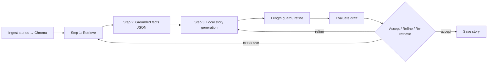

# Project Journey: StoryForge-RAG

I built **StoryForge-RAG** around one question:

**Can I ship an end-to-end pipeline that turns book/story sources into grounded, evaluated narratives—with honest quality limits on consumer GPU hardware?**

This document explains how the system evolved: what I tried, what broke, what I fixed, and where it stands today.

I used AI assistants for research and debugging speed; architecture and implementation decisions are mine.

---

## Current system (2026)

The public repo (`src/storyforge/`) runs a **grounded 3-step RAG** pipeline plus an optional **agentic loop**. Story length is controlled by one request/config target (`length`), not by three independent knobs that used to disagree.


```mermaid
flowchart LR
    ingest["Ingest stories → Chroma"] --> s1["Step 1: Retrieve"]
    s1 --> s2["Step 2: Grounded facts JSON"]
    s2 --> s3["Step 3: Local story generation"]
    s3 --> guard["Length guard / refine"]
    guard --> eval["Evaluate draft"]
    eval --> decide{"Accept / Refine / Re-retrieve"}
    decide -->|refine| s3
    decide -->|re-retrieve| s1
    decide -->|accept| out["Save story"]
```

| Stage | What it does | Typical model |
|--------|----------------|----------------|
| **Step 1** | Chroma search + hybrid BM25 + optional rerank; diverse story titles | `BAAI/bge-base-en-v1.5` embeddings |
| **Step 2** | Extract grounded facts (JSON with chunk ids) | HF router `Qwen/Qwen3-8B` (API); Ollama fallback |
| **Step 3** | Write a fixed **5-section** story from facts only, sized by `length` | Ollama `qwen3.5:9b` (also vLLM / Transformers) |
| **Length profile** | One target drives prompt guidance, token budget, and accept gate | `src/storyforge/rag/length_profile.py` |
| **Agentic loop** | Score each draft; refine incomplete stories or widen retrieval | HF eval 7B → Gemini fallback (or local model, `Evaluation_mode: "local"`) |

**Orchestrator steps:** prepare story JSON → reset/ingest Chroma → `4_generate_story_3step` or `4_generate_story_agentic` (when `Agentic_loop_enabled`).

**Length on generate requests:** pass `length` as a preset (`short` / `medium` / `long` / `epic`), a narration duration (`"13min"`), or a word count (`"1800"`). Omit it and the mode default applies (`fast` → short, `thinking` → long). `mode` selects sampling / thinking; `length` selects how much prose to write.

---

## Evolution: from three layers to grounded RAG

### Earlier approach (v1 narrative)

I first shipped a **multi-layer** path: 5W1H extraction → sectioned summary per `flow_structure.yaml` → multi-pass expansion. It produced longer text but often **lost facts** between layers and repeated beats across sections.

### Pivot: grounded single-pass

I replaced that chain with:

1. Retrieve relevant chunks.
2. Extract **attributable facts** (must cite `source_chunk_ids`).
3. Generate **once** from a bullet list of facts—not from a lossy intermediate summary.

Prompt contracts live in `prompts.yaml` (`grounded_facts_*`, `grounded_story_*`, `grounded_story_refine_*`).

### Latest: agentic loop + length target

Short stories were stable; **long-form (~1,200–2,200 words)** exposed new failure modes (early stop at section 3, prompt leakage, broken dialogue quotes, loop choosing re-retrieve instead of refine, and — most importantly — output stuck at ~450 words even when token budgets were large).

I added `agentic_loop.py`:

- **REFINE** when the draft is incomplete but grounding is good (finish sections, don’t restart retrieval).
- **RE_RETRIEVE** only when faithfulness is low or facts are empty/thin.
- **ACCEPT** when rubric average and completeness heuristics pass.

Then I fixed the real length ceiling: the prompt still said “prefer 3–6 sentences per section,” so the model did exactly that and stopped. Raising `Single_pass_*_max_tokens` alone changed nothing. The fix was a single **length profile** that keeps prompt guidance, token budget, and accept gate in sync (see session below).

Post-save cleanup in `generative_ai.clean_story_output()` fixes common formatting artifacts (unclosed quotes, instruction leakage before `[SECTION 1]`, duplicate words).

---

## Architecture modules

| Module | Role |
|--------|------|
| `storyforge/book_search/` | Archive.org download, text extraction |
| `storyforge/data/` | `story_json` workflow, HF summarization helpers |
| `storyforge/vector_store/` | Chroma + ingest with BGE-aligned embeddings |
| `storyforge/rag/retrieval.py` | Step 1: Chroma + hybrid BM25 + reranker |
| `storyforge/rag/extraction.py` | Step 2: HF API grounded facts, local fallback |
| `storyforge/rag/generation.py` | Step 3: Ollama / vLLM / Transformers story generation |
| `storyforge/rag/length_profile.py` | Resolve `length` → prompt + tokens + accept gate |
| `storyforge/rag/langchain_rag.py` | 3-step orchestrator + length guard |
| `storyforge/rag/agentic_loop.py` | Evaluate → REFINE / RE_RETRIEVE / ACCEPT |
| `storyforge/rag/attribution.py` | Grounded-facts parsing, attribution gate |
| `storyforge/rag/generation_backend.py` | Ollama / vLLM loaders, `build_chat_openai`, `strip_thinking_tags` |
| `storyforge/evaluation/` | HF → Gemini, or local Transformers (`Evaluation_mode: "local"`) |
| `storyforge/orchestrator/` + `api/` | Pipeline steps, FastAPI routes, SSE stream |

Lazy imports in `rag/__init__.py` keep unit tests runnable without loading Transformers on import.

---

## What failed (and what fixed it)

### Retrieval and scale

- **Symptom:** Wrong story in context when multiple tales appeared in one retrieval batch.
- **Mitigation:** Diverse title selection, reranker, entity-biased query reformulation on re-retrieve; grow `data/stories` + re-ingest after embedding model changes.

### Grounding and attribution

- **Symptom:** Names and events not in source chunks.
- **Mitigation:** Strict Step 2 JSON schema; generation prompts forbid new named entities; attribution gate now **log-only** by default (heuristic NER was truncating good stories).

### Evaluation blocking the loop

- **Symptom:** HF `hf-inference` returned 400 for 7B judge; Gemini 503 stalled retries.
- **Mitigation:** Route HF eval through `InferenceClient.chat_completion`; fall back to Gemini on **any** HF failure.

### Long-form generation

- **Symptom:** Incomplete 5-section stories, `accepted: false` despite high scores, dialogue/quote formatting bugs, and drafts stuck at ~450 words even with `Single_pass_fast_max_tokens: 3200`.
- **Root cause (later found):** Prompt wording (`prefer 3–6 sentences per section`) and accept-gate minima lived separately from the token budget. Raising only the budget left the model obeying a short prompt and the loop accepting a short draft.
- **Mitigation (v1):** Higher token floors, refine prompts, `decide_action` prefers REFINE over RE_RETRIEVE for incomplete grounded drafts.
- **Mitigation (current):** Unified `LengthProfile` — one `length` target derives prompt `{length_guidance}`, `max_new_tokens`, `min_words`, and `min_sentences_per_section`. Removed hand-tuned `Min_sentences_per_section` / `Agentic_loop_min_words*` from config so they cannot silently contradict the target. Also raised `Story_generation_n_results` (10) and `HF_grounded_facts_max_new_tokens` (1600) so long prose has enough grounded material instead of padding.

### Honest quality tiers (local GPU)

| Tier | Target | How to request | Status |
|------|--------|----------------|--------|
| **Short** (~450 words / ~3 min) | Single-pass | `mode: "fast"` or `length: "short"` | **Works reliably** |
| **Medium** (~900 words / ~6 min) | Single-pass or agentic | `length: "medium"` | **Usable** |
| **Long (Level B)** (~1,500 words / ~11 min) | Agentic + refine | `mode: "thinking"` or `length: "long"` / `"13min"` | **Improving** — length gates now agree; empty thinking drafts retry automatically with fast sampling |
| **Epic (Level C)** (~2,200 words / ~16 min) | Agentic + richer retrieval | `length: "epic"` | **Experimental** — latency grows; thin facts risk repetition |

On consumer 16 GB VRAM with Ollama, the ceiling is less about OOM and more about wall-clock time + empty thinking-mode responses that strip to `0` words before refine.

---

## Key technical decisions

- **Embeddings:** `BGE-base-en-v1.5`; only the query gets the BGE instruction prefix at search time (per BGE's documented recipe) -- passages are embedded with no prefix. Must re-ingest after a model change, and required a one-time re-ingest (2026-09) after fixing ingest to stop wrongly prefixing passages too.
- **Generation:** Ollama `qwen3.5:9b` by default (warm model outside the Python process); Transformers / vLLM still supported via `Generation_provider`.
- **Facts extraction:** HF API (`Qwen/Qwen3-8B`) so Step 2 does not compete with Step 3 for VRAM; local Ollama fallback when HF returns 502 / rate limits.
- **Length:** One derived profile beats three hand-tuned knobs. Presets live in `Story_length_presets`; requests override with `length`.
- **Config:** Secrets in `setup.yaml` (gitignored); template in `setup.example.yaml`. Config and prompts are cached — restart the API after edits. Fixed (2026-09) a `.gitignore` bug where the legacy `Vector_Store/` (and `API/`, `Orchestrator/`, `Evaluation/`, `Book_search/`) ignore patterns, combined with this checkout's case-insensitive git config, silently matched the real `src/storyforge/vector_store/` package too -- `embeddings.py` had never been committed as a result. Patterns are now anchored to the repo root (`/Vector_Store/`, etc.) so they only match the removed legacy top-level dirs.
- **Tests:** Pure decision tests for agentic loop + length profile; lightweight pytest without GPU.

---

## What this demonstrates

- End-to-end **RAG product shape**: ingest → retrieve → ground → generate → evaluate.
- **Failure-aware engineering**: rate limits, OOM, bad retrieval, API route mismatches, loop policy bugs.
- **Iterative evidence**: debug runs, saved outputs under `data/outputs/`, config-driven prompts.
- **API-first** delivery via FastAPI (`/orchestration`, `/create-eval`, vector store routes).

---

## Scope and boundaries

- Manual curation of `data/story_json` and ingest manifests is intentional for controlled demos.
- Evaluation is rubric-based LLM scoring—not human literary judgment.
- I share **strengths and limits** openly for job-search review; the system is a learning vehicle, not a finished product.

---

## Session: Ollama Docker migration + hardening (2026)

This session migrated Step 3 generation from bare Transformers to **Ollama in Docker**, fixed a set of accumulated technical debt items, and added the planned upgrade features.

### Motivation

Running `AutoModelForCausalLM` inside the Python process meant:
- Model cold-start on every API restart (~20 s for 7B).
- VRAM fully consumed by the Python process; no easy warm-swap of model variants.
- No streaming — the full story had to complete before the API returned.

Ollama in Docker solves all three: model stays warm, Ollama manages GPU memory outside the process, and `ChatOllama.astream` enables per-token streaming.

### Fixes applied

**Security:** Three API keys found hardcoded in `setup.yaml` were blanked and user was instructed to rotate them. `secrets.py` now consolidates all HF token env-var aliases (`STORYFORGE_HF_API_KEY`, `HUGGINGFACEHUB_API_TOKEN`, `HUGGINGFACE_API_KEY`, `HF_TOKEN`) into a single `facehugging_api` config key.

**Model name bugs:** `Gemini_evaluation_model` pointed at the non-existent `"gemini-3-flash-preview"`; corrected to `"gemini-2.0-flash"` in both `setup.yaml` and `setup.example.yaml`. HF fallback model in `_hf_chat_extract_json` was set to the Ollama tag `"qwen3.5:9b"` instead of a valid HF repo ID.

**Qwen3.5 thinking tags:** `qwen3.5:9b` can emit `<think>...</think>` blocks before the response. Added `strip_thinking_tags()` in `generation_backend.py` (defensive strip even when `think=False`) and the `think=` parameter to `ChatOllama`.

**repeat_penalty placement:** Moved from top-level `ChatOllama` kwargs (rejected in newer langchain-ollama) into `options={"repeat_penalty": ...}`.

**Module-level globals in evaluation.py:** Six process-wide globals (`evaluation_provider_priority`, `hf_evaluation_model`, etc.) broke test isolation. Replaced with per-call `_cfg()` reads; tests now monkeypatch `_cfg` directly.

### New features shipped

**Hybrid BM25 + dense retrieval:** `rag/retrieval.py` fuses Chroma dense results with a BM25 pass over the same candidate pool using Reciprocal Rank Fusion. Controlled by `Hybrid_search_enabled` and `Hybrid_bm25_weight` in `setup.yaml`. Captures exact name/keyword matches that vector similarity misses. Depends on `rank-bm25` (required in `requirements.txt`); if the package is missing, BM25 fusion is skipped with a warning and dense + rerank still run.

**Metadata filtering:** `retrieve_docs` now accepts `filter_metadata` (a Chroma `where` filter), enabling targeted series- or story-type-scoped retrieval.

**`langchain_rag.py` split:** The 971-line monolith was split into three focused modules — `retrieval.py`, `extraction.py`, `generation.py` — plus a thin orchestrator. `agentic_loop.py` imports continue to resolve via re-exports in `langchain_rag.py` with no changes to the caller.

**Streaming endpoint:** `POST /orchestration/generate_stream` returns Server-Sent Events. Steps 1–2 run in a thread, Step 3 streams tokens from Ollama via `ChatOllama.astream`. Contract tests in `tests/test_api_contracts.py` run with zero external dependencies.

**Context window expansion:** `Model_max_prompt_tokens: 12288`. Token floors remain (`Single_pass_fast_max_tokens: 3200`, `Single_pass_thinking_max_tokens: 4000`) but the **effective** budget is now max(floor, length-derived) capped by `Story_length_max_new_tokens_cap`.

**Step 2 model upgrade:** `HF_grounded_facts_model: "Qwen/Qwen3-8B"` — better JSON extraction than the previous 7B instruct model, still API-only (no VRAM cost).

**Structured JSON output for Step 2:** `HF_grounded_facts_json_mode: true` in `setup.yaml`. `_hf_chat_extract_json` passes `response_format={"type": "json_object"}` to the HF `InferenceClient`, constraining Qwen3-8B to valid JSON at the token level. Falls back gracefully (retry without flag + warning) if the backend doesn't support it. The `repair_json()` call in `attribution.py` is kept as a safety net for the local-fallback path. Tests in `tests/test_extraction.py`.

**Test suite consolidation:** three micro-files absorbed into larger homes — `test_prompt_contracts.py` → `test_config.py`; `test_generation_backend.py` + `test_story_cleanup.py` → `test_rag_utils.py`.

---

## Session: unified story-length target (2026)

This session fixed the “why won’t my story grow past ~450 words?” failure that token-budget tuning alone could not solve.

### Diagnosis

A ~10–15 minute narration script needs roughly 1,300–2,250 words. Observed drafts were ~450 words even with `Single_pass_fast_max_tokens: 3200` (room for ~2,200+ words of output). The model was obeying the prompt:

- “Prefer 3–6 sentences per section”
- “EACH section MUST contain at least 3 complete sentences”

Five sections × ~4–5 sentences × ~15–20 words ≈ **400–500 words**, regardless of token headroom. The agentic accept gate (`Agentic_loop_min_words*`) also only required a short story to pass.

### Design

Introduce one `LengthProfile` that derives:

| Derived field | Used by |
|---------------|---------|
| `guidance_text()` → `{length_guidance}` | `prompts.yaml` story + refine templates |
| `max_new_tokens` | Ollama / vLLM / Transformers generation |
| `min_words` | Agentic completeness gate |
| `min_sentences_per_section` | Completeness gate + 3-step length guard |

Resolution order for a request: explicit `length` → mode default (`Story_length_default_fast` / `_thinking`) → fallback preset.

Accepted `length` forms: preset name, `"12min"` (words = minutes × `Story_length_words_per_minute`), or an integer / numeric string word count.

### Changes shipped

- New module: `src/storyforge/rag/length_profile.py`
- Prompts: replace hardcoded sentence ranges with `{length_guidance}`
- Config: `Story_length_presets`, defaults, WPM, token cap; remove hand-tuned `Min_sentences_per_section` / `Agentic_loop_min_words*`
- Wire `length` through generation, 3-step orchestrator, agentic loop, orchestrator helpers, and API request models (`/create-eval/story_generate`, `/orchestration/run_step`, `/run_pipeline`, `/generate_stream`)
- Shared `build_story_prompt` / `build_refine_prompt` so streaming cannot drift from non-streaming
- Companion knobs for long prose: `Story_generation_n_results: 10`, `HF_grounded_facts_max_new_tokens: 1600`
- Tests: `tests/test_length_profile.py` + updated prompt/config contracts

### Remaining open issue (resolved — see the empty-draft recovery session below)

Thinking mode could return an empty body (budget spent inside `<think>`). That path now retries once with fast sampling and raises a clear `RuntimeError` if both attempts are empty; the length-guard refine falls back to the pre-refine draft. Prefer `mode: "fast"` + `length: "13min"` when you want the most reliable long target.

### Architecture modules (current)

| Module | Role |
|--------|------|
| `storyforge/book_search/` | Archive.org download, text extraction |
| `storyforge/data/` | `story_json` workflow, HF summarization helpers |
| `storyforge/vector_store/` | Chroma + ingest with BGE-aligned embeddings |
| `storyforge/rag/retrieval.py` | Step 1: Chroma + hybrid BM25 + reranker |
| `storyforge/rag/extraction.py` | Step 2: HF API grounded facts, local fallback |
| `storyforge/rag/generation.py` | Step 3: Ollama / vLLM / Transformers story generation |
| `storyforge/rag/length_profile.py` | Resolve `length` → prompt + tokens + accept gate |
| `storyforge/rag/langchain_rag.py` | 3-step orchestrator + length guard |
| `storyforge/rag/agentic_loop.py` | Evaluate → REFINE / RE_RETRIEVE / ACCEPT |
| `storyforge/rag/attribution.py` | Grounded-facts parsing, attribution gate |
| `storyforge/rag/generation_backend.py` | `load_ollama_llm`, `build_chat_openai`, `strip_thinking_tags`, vLLM |
| `storyforge/evaluation/` | HF → Gemini, or local Transformers (`Evaluation_mode: "local"`) |
| `storyforge/orchestrator/` + `api/` | Pipeline steps, FastAPI routes, SSE stream |

---

## Session: vLLM backend, empty-draft recovery, structural cleanup, local evaluation (2026)

This session had two parts: closing out the roadmap's remaining high-value items, and a
structure pass to remove drift and dead code accumulated across earlier sessions.

### vLLM as a second generation backend

Added `generation_backend.py: load_vllm_llm()` (a `langchain_openai.ChatOpenAI` client
against a local OpenAI-compatible vLLM server) alongside the existing Ollama path.
`generation_provider(cfg)` now resolves `ollama` / `vllm` / `transformers` from
`Generation_provider`, and `generation.py`'s `_load_generation_llm()` dispatches on it
before falling through to Ollama. Useful for concurrent/batched generation; for a single
local user, Ollama remains the simpler default.

### Empty-draft recovery

Thinking mode occasionally returned a fully empty draft (the model spent its whole budget
inside `<think>...</think>`, which `strip_thinking_tags()` then strips to nothing).
`generate_from_facts()` now retries once with `mode="fast"` sampling before giving up, and
raises a clear `RuntimeError` (rather than returning `""`) if that retry is also empty. The
length-guard refine pass in `langchain_rag.py` catches that `RuntimeError` and falls back to
the original (pre-refine) draft instead of losing the story entirely. This closed the
"remaining open issue" from the previous session.

**Follow-up gap, caught in review:** the first pass only wired this into the 3-step length
guard — `agentic_loop.py`'s `run_agentic_story_loop()` called `generate_from_facts()` with no
`try/except` at all, so a `RuntimeError` on iteration 2+ still aborted the whole loop and
discarded every earlier iteration's `best` draft, propagating up as a generic `success: false`
with no draft attached. The loop now catches `RuntimeError` per iteration, records a
`generation_failed` entry in `iterations` for visibility, and stops with the best draft seen
so far (`stop_reason: "generation_failed_using_best_so_far"`) — or a clear empty result with
`stop_reason: "generation_failed"` if it happens on the very first iteration, when there's no
prior draft to fall back to. Tests in `tests/test_agentic_loop.py`.

### Structural cleanup

A pass through the whole `src/storyforge/` tree against an earlier internal audit
(`StoryForge_pattern_audit.md`) found most high-severity findings already fixed in prior
sessions. What was still live:

- Removed ~90 lines of dead code in `book_search/fetch_book.py`
  (`download_archive_book_and_save_meta` was never called anywhere — the live download
  flow was reimplemented separately in `orchestrator/response_parameter.py`).
- `_split_section_bodies` / `_sentence_count` / `_SECTION_HEADER_RE` were independently
  defined in both `generation.py` and `agentic_loop.py` — the exact "duplicated logic that
  drifts" pattern the audit called out. Consolidated into `length_profile.py` as the single
  shared source.
- The vLLM `ChatOpenAI` client was being built inline in `orchestration_routes.py`,
  duplicating `load_vllm_llm()`'s guts. Extracted a shared `build_chat_openai()` so the
  streaming and non-streaming paths can't drift the way the Ollama client once did.
- Aligned divergent hardcoded defaults (`Chroma_path`, `Story_input`) that only worked
  because `setup.yaml` happened to set them explicitly — an omitted key would have silently
  pointed ingest and retrieval at different directories.
- Fixed `secrets.py` resolving `.env` relative to its own file location instead of the repo
  root (every other module uses the repo-root convention).
- `orchestrator.run_pipeline` hardcoded `formats=["pdf", "epub"]` for step 0, making the
  configured `Download_formats` key unreachable — now reads it from config.
- Removed the dead `Prompts_file` config key (declared in both YAMLs, read nowhere).
- Added the missing `vLLM_base_url` / `vLLM_model` keys to the real `setup.yaml`, and the
  missing `Generated_story_output` / `Generated_summary_output` / `Evaluated_stories_output`
  keys to `setup.example.yaml` so a fresh clone matches the real output layout.

### Local evaluation model

Added `Evaluation_mode: "local"` as a third path alongside the existing HF/Gemini API
chain. `evaluate_model()` checks it first and, when set, short-circuits straight to a local
evaluator descriptor instead of racing through `Evaluation_provider_priority`.
`_invoke_local_once()` loads a small causal LM (`Local_evaluation_model`, default
`Qwen/Qwen2.5-3B-Instruct`) via Transformers, cached by `(model_id, device)` so it loads
once per server process and is reused across every agentic-loop iteration afterward. If the
local model fails for any reason (OOM, missing weights), `_invoke_local_with_fallback()`
catches it and retries through the normal HF → Gemini chain rather than failing the loop.

`Local_evaluation_device` defaults to `"cpu"` deliberately — loading a second model on
`"cuda"` alongside Ollama's own CUDA context has been observed to starve VRAM on a 16 GB
card (see the `Reranker_device` note in `setup.yaml`). This removes one full external API
round-trip (extraction already uses one) from every agentic-loop iteration when enabled.

---

## What I am doing next

1. ~~Fix the BGE passage-prefix convention~~ — done (2026-09): ingest no longer prefixes passages, only queries do. Re-ingested (72 files, 2138 chunks).
2. ~~Stronger retrieval eval harness~~ — `tests/fixtures/retrieval_eval_cases.example.json` now has 30 realistic cases (distinctive names, plot beats, wrong-book traps) covering the full corpus; `scripts/retrieval_eval.py` reports top-1/top-k/fact_coverage.
3. ~~Wire the eval harness to the real retrieval pipeline~~ — done (2026-09): post re-ingest baseline was top1=0.80, top3=0.83, fact_coverage=0.67, but the harness was calling `Orchestrator.query_vector_store()` → `chromadb.query_data()`, a bare dense-only Chroma query -- not `storyforge.rag.retrieval.retrieve_docs()`, the actual Step 1 pipeline with hybrid BM25 fusion, diverse-title selection, and cross-encoder reranking. `Hybrid_bm25_weight` / rerank-order tuning was therefore invisible to this metric no matter what you set it to. `scripts/retrieval_eval.py` now calls `retrieve_docs()` via `make_retrieve_docs_query_fn()`. Re-run the baseline command below to get true numbers before tuning either knob:
   ```
   py scripts/retrieval_eval.py --cases tests/fixtures/retrieval_eval_cases.example.json --k 3
   ```
4. ~~Rerank-before-diversity~~ — done (2026-09). True-pipeline baseline (72 files / 2138 chunks) was top1=0.80, top3=0.87, fact_coverage=0.77 (`Evaluation/retrieval_eval_report.json`). Of the 6 top1 misses, 4 had the expected title *in the pool but ranked low* (Jekyll_and_Hyde__Olalla rank 7, Jekyll_and_Hyde__The_Body_Snatcher rank 6, Lovecraft__Cool_Air rank 3, Lovecraft__The_Haunter_of_the_Dark rank 2) and 2 weren't in the pool at all (Frankenstein, Lovecraft__The_Statement_of_Randolph_Carter, both `expected_rank: null`).

   **Hypothesis:** `retrieve_docs()` ran `_select_diverse_stories()` *before* `_rerank_docs()`. Diversity picked its up-to-3 titles from the raw dense+BM25-fused order and discarded everything else, so (a) a title outside those first 3 never reached the reranker at all (explains the two `null`-rank misses) and (b) a title that did survive was only reranked against the few other titles diversity happened to keep, not the full ~40-candidate pool (explains the 4 low-rank misses). Reordering to rerank the full fused pool first, then run diversity selection on that better-ordered list, should let the cross-encoder's relevance judgment -- not raw dense/BM25 order -- decide which titles diversity keeps.

   **Change:** swapped the two blocks in `retrieve_docs()` (`src/storyforge/rag/retrieval.py`) -- rerank now runs on the full hybrid-fused pool, diversity selection runs on the reranked output. No config values changed; `Hybrid_bm25_weight` and `Story_generation_rerank_top_n` untouched. Regression tests in `tests/test_retrieval.py` assert the call order and that rerank sees the full pool (they fail against the old order).

   **Re-measure:**
   ```
   py scripts/retrieval_eval.py --cases tests/fixtures/retrieval_eval_cases.example.json --k 3
   ```

   **A/B result (2026-09):**

   | | top1 | top3 | fact_coverage |
   |---|---|---|---|
   | Before (rerank after diversity) | 0.80 | 0.87 | 0.77 |
   | After (rerank before diversity) | 0.80 | **0.90** | 0.77 |

   top3 improved, top1 and fact_coverage held steady, nothing regressed. **Kept.**

5. **Phase 1 retrieval tuning: stopped here (2026-09).** Re-ran the eval after the A/B; 6 of 30 cases still miss top1. Classified against the true baseline's remaining report:

   | query (abridged) | expected_title | expected_rank | class |
   |---|---|---|---|
   | Swiss scientist assembles a creature from dead body parts | Frankenstein | null | A -- never retrieved |
   | grave robbers supply corpses to an anatomy school | Jekyll_and_Hyde__The_Body_Snatcher | null | A -- never retrieved |
   | doctor sends patient to the countryside, falls for a woman | Jekyll_and_Hyde__Olalla | 3 | B -- in pool, rank 3 |
   | man explains why his room must stay refrigerated | Lovecraft__Cool_Air | 3 | B -- in pool, rank 3 |
   | man struck down near a church after a shining stone | Lovecraft__The_Haunter_of_the_Dark | 3 | B -- in pool, rank 3 |
   | prisoner insists he remembers a catacombs expedition | Lovecraft__The_Statement_of_Randolph_Carter | 9 | B -- in pool, rank 9 |

   4 of 6 are technically "B" (in the pool, just not #1), which per the standing playbook would suggest tuning `Hybrid_bm25_weight` or `Story_generation_rerank_top_n` next. Traced both through the code instead of guessing, and neither is viable as a single next move:

   - **`Hybrid_bm25_weight` is a no-op on the final ranking whenever `Reranker_enabled` is true (the default).** `_rrf_fuse()` only *reorders* the dense-retrieved candidate set (BM25 reranks the same top-k pool the dense query returned; it cannot pull in corpus chunks dense missed). After the item-4 reorder, `_rerank_docs()` then rescores *every* candidate from scratch with the cross-encoder and sorts purely on that score -- a deterministic function of `(query, chunk text)`, not of the incoming order. So changing the fusion weight changes an ordering that gets immediately thrown away. Documented in `setup.example.yaml` and as a code comment in `retrieve_docs()` so this isn't rediscovered the hard way later. (It would matter again with reranking disabled, where diversity selection reads the fused order directly.)
   - **`Story_generation_rerank_top_n`** (currently 10) only changes how many reranked candidates survive into diversity selection. All three rank-3 misses and the rank-9 miss are already inside that window -- raising it doesn't reorder anyone already included, and lowering it below 9 would drop Randolph_Carter's chunk entirely without helping the rank-3 cases.

   The 2 "A" misses are a genuine embedding/corpus collision, not a pool-size artifact: both are confused with the *same* book, `Lovecraft__Herbert_West-Reanimator` -- a story about reanimating corpses that BGE-base apparently embeds closer to "assembles a creature from dead body parts" / "grave robbers supply corpses" than the actual target passages are. The over-fetch pool (k≈40) already includes far more than 3 titles' worth of candidates; a bigger k is unlikely to be the lever, and the fix that would plausibly help -- entity-biased query reformulation, or corpus/chunking changes so Frankenstein's and Body_Snatcher's most distinctive passages surface more often -- is not a one-line change. Stopping Phase 1 retrieval tuning here per the standing instruction to prefer stopping over a change that isn't clearly scoped.

   **Phase 2 measurement (2026-09):** `py scripts/measure_generation_length.py --mode fast --length long`, 8 queries, target 1500 words (min 1275):

   | Metric | Value |
   |---|---|
   | Succeeded | 8/8 |
   | Accept rate | 0.88 (7/8) |
   | Under min words | 0.0 |
   | Avg words | 1864 vs target 1500 |
   | Avg iterations | 1.62 |

   **Length is not the reliability problem.** Nothing came in under `min_words`; drafts usually overshoot target. The original goal-2 hypothesis ("thin facts cause short/padded prose") is not supported by this data as stated -- but the raw per-iteration report surfaced two real issues the summary table hid:

   - **`facts_count` (`len(parsed.facts)` from Step 2) was 0 on 5 of 8 queries**, vs. 10-12 on the other 3 -- not uniformly thin, inconsistent. Traced `extract_grounded_facts()` (`src/storyforge/rag/extraction.py`): a parse failure silently returned `ParsedFacts(facts=(), raw={})` with no logging, and separately, `attribution.parse_grounded_facts_json()` silently drops any fact missing `source_chunk_ids`/`sources`, also unlogged. Either could explain the zeros and there was no way to tell which from the existing logs. **Also found while checking:** with no eval provider available (see faithfulness note below), `decide_action()`'s no-eval fallback path accepts on completeness alone -- it does not require `facts_count > 0` -- so a fully "accepted" story can currently have zero grounded facts behind it. That's a real gap in the grounding guarantee, separate from length.
   - **`average_score` was 0.0 on every iteration of all 8 queries.** Not a bug: `Evaluation_mode: "api"` failed for every call (`HF_evaluation_model: "Qwen/Qwen2.5-7B-Instruct"` returned `model_not_supported` from the HF router), so every iteration ran through `decide_action()`'s `has_eval=False` branch, which never computes a real average -- it decides on completeness + facts_count only. Expected behavior given the eval outage, not itself a defect, but it means **this run measured length/accept behavior under the no-eval fallback path, not the scored path** -- worth knowing before comparing future runs where the HF eval works.
   - **One failure, case 6 ("whispering farmhouse"), stop_reason=`max_iterations`:** facts_count was 10 throughout (not thin), but `completeness_ok` stayed `False` across all 3 refine iterations while the draft *shrank* each time (2622 -> 1786 -> 821 words) instead of converging. `missing_sections`/`reasons` weren't captured by the script in this run, so the exact completeness gate that kept failing isn't known yet.

   **Change made (diagnostics only, no behavior change):**
   - `extraction.py`: log the parse exception (with a truncated raw response) on failure, and log a warning whenever extraction yields 0 usable facts -- includes how many raw `"facts"` entries the model returned vs. how many survived filtering, so the next run shows whether the model returned nothing, returned facts missing `source_chunk_ids`, or the JSON failed to parse.
   - `scripts/measure_generation_length.py`: iteration records now also capture `missing_sections` and `reasons`, so a repeat of case 6's pattern will show exactly which completeness check keeps failing and why refine isn't fixing it.
   - `python -m pytest -q`: 104 passed (unchanged baseline); log-only change, no logic touched.

   **Also observed in the run log:** `rank-bm25` wasn't installed in the venv that ran this, so hybrid BM25 fusion was silently disabled (dense + rerank still ran). **Fixed (2026-09):** `rank-bm25>=0.2.2,<1` is now a required entry in `requirements.txt` (was previously commented under OPTIONAL) and installed in the project `.venv`. Fresh `pip install -r requirements.txt` installs it; without it, `retrieve_docs()` still logs a warning and continues dense-only. Not a Phase 1 retrieval-tuning change.

   **Root cause found (2026-09) and fixed.** Two more measurement rounds (with the real HF eval provider up this time, not the no-eval fallback) showed the true scale of the problem: accept rate collapsed to 0.12, then 0.25 (vs. 0.88 when eval was down) -- because 22-23 of 24 logged iterations had `facts_count: 0, reasons: ['no grounded facts extracted']`, and `decide_action()` forces `RE_RETRIEVE` whenever `facts_count <= 0`, *before* it even looks at the (excellent, 8.8-9.2) average score or completeness. Retrieval, length, and the eval model were all fine; Step 2 (grounded-facts extraction) was the actual failure, almost universally, once the eval-masking was gone.

   Diagnosed with the repo's existing `scripts/debug_hf_grounded_facts_mode.py` probe (`--show-raw`) rather than another full batch run:
   ```
   MODEL: Qwen/Qwen3-8B
   FINISH_REASON: length
   USAGE: completion_tokens=1600 (all of it)
   FACTS_PARSED: 0
   RAW_PREVIEW: <empty>
   REASONING_CONTENT_PREVIEW: Okay, let's tackle this query. The user is asking about...
   ```
   `Qwen/Qwen3-8B` (the configured `HF_grounded_facts_model`) emits hidden chain-of-thought by default. That reasoning counts against `max_tokens`, and for this structured-extraction call it reliably consumed the entire 1600-token budget before the model ever wrote the JSON answer -- `finish_reason: "length"`, empty `message.content`, 0 facts, every time. Not a length problem, not a retrieval problem, not a parser-schema problem (the parser was never even reached).

   **Fix (2026-09):** `_hf_chat_extract_json()` (`src/storyforge/rag/extraction.py`) now sends `extra_body={"chat_template_kwargs": {"enable_thinking": False}}` on the HF grounded-facts call, gated by new config `HF_grounded_facts_disable_thinking` (default `true`, documented in `setup.example.yaml`). If a backend rejects the kwarg with `TypeError`, the call retries once without it (and without `response_format`, since a bare `TypeError` doesn't say which optional kwarg was the problem) rather than failing extraction outright. 3 new unit tests in `tests/test_extraction.py` cover: extra_body sent by default, extra_body omitted when the config flag is off, and the retry-without-optional-kwargs path on `TypeError`. `python -m pytest -q`: 107 passed (104 baseline + 3 new), same 8 pre-existing chromadb-on-network-mount errors as before (unrelated to this change).

   **First fix attempt (`extra_body.chat_template_kwargs.enable_thinking: False`) did not work** -- re-probed and found the reasoning trace was statistically unchanged with the flag on vs. off (845 vs. 1359 completion tokens, same style/length of chain-of-thought either way): this specific HF-routed backend for Qwen3-8B silently ignores that kwarg. A follow-up full batch with the "fix" in place still showed `facts_count: 0` on 20 of 24 iterations, confirming it did nothing.

   **Second fix: `/no_think` prompt suffix (2026-09).** Qwen3 is separately trained to honor a literal `/no_think` token in the user turn regardless of whether the serving stack exposes an API-level toggle. Appended to the user message in `_hf_chat_extract_json()` (kept `extra_body` too, harmless if ignored, may help other providers/models later). Verified with the debug probe: `REASONING_CONTENT_FULL` went from a full paragraph of chain-of-thought to completely empty, and `FACTS_PARSED: 8` with a real JSON answer (`completion_tokens: 460`, well under budget). This part of the fix is confirmed working.

   **Third finding: a second, real problem underneath the first.** With reasoning now suppressed, a single real query (10 actual retrieval chunks, not the debug probe's 2-line demo) still failed extraction on all 3 iterations: `finish_reason=length`, `completion_tokens=1600` (maxed exactly every time), `prompt_tokens` ~3900-4050. The JSON facts answer itself -- not hidden reasoning -- is large enough on real chunk volume (asking for 10-30 facts with quotes) to exceed 1600 tokens and get cut off mid-object, which then fails to parse (`Expecting ',' delimiter`) and yields 0 usable facts. Added `LOG.info`/`LOG.warning` in `_hf_chat_extract_json()` logging `finish_reason`/`usage` on every call so this is visible going forward without needing a probe.

   **Fix applied (2026-09):** `HF_grounded_facts_max_new_tokens` raised from 1600 to 3200 in both `setup.yaml` and `setup.example.yaml`, with a comment recording the measured cause. This is the same knob goal 2 originally proposed -- it just wasn't reachable until the reasoning-token problem was fixed first (raising it while the model was still spending the whole budget on hidden thinking would not have helped).

   **Separately observed, not a code issue:** the HF eval API returned `402 Payment Required -- monthly included credits depleted` partway through the single-query verification run. That's an account/billing limit on Hugging Face Inference Providers credits, not a bug -- expect `faithfulness: None` and the no-eval fallback path until credits are topped up or reset.

   `python -m pytest -q`: 107 passed throughout all of the above (same 8 pre-existing chromadb-on-network-mount errors, unrelated).

   **Full-batch re-run (2026-09) after both fixes: accept_rate 0.75, then 0.75 again on a repeat run -- promising, but NOT a clean read.** Two queries (of 8) got genuine end-to-end extraction with real fact counts (29, 20 facts, no truncation) -- direct confirmation the /no_think + 3200-token fixes work when the HF facts-extraction call actually runs. But most of both runs' "accepted" stories went through `reasons: ['complete (no eval provider)']` with `average_score: 0.0, faithfulness: None` -- the same completeness-only fallback that inflated the very first measurement, now triggered because **HF credits were depleted again mid-run** (`402 Client Error: Payment Required`). This time the 402 hit the *extraction* call too, not just evaluation, so `extract_grounded_facts()` fell back to the local Ollama model (`_load_facts_llm()`) for most queries -- and that local fallback then failed its own way: `Grounded-facts JSON parse failed` at small, early character offsets (227-2860, one `"Unterminated string"`), nothing like the ~5700-7000 char truncations that pointed to a token-budget problem before. This is a *different, newly-discovered* bug -- the local extraction fallback has no `response_format`/JSON-mode enforcement the way the HF `InferenceClient` call does, so it produces malformed JSON more easily. It was only visible now because credits ran out and forced (almost) every query onto that path.

   **Net effect: this batch's 0.75 accept rate is not a trustworthy measurement of either fix.** It's dominated by the credits outage and the newly-found local-fallback JSON bug, not by the /no_think + token-budget work, which is independently confirmed (by the 2 queries that got real extraction, and by the earlier clean single-query verification runs while HF was reachable).

   **Decision (2026-09): wait for HF credits to reset/be topped up before re-measuring**, rather than guess-fixing the local-fallback JSON issue without clean diagnostic data on it. No further code changes until then.

   **Next step, once HF credits are available again:**
   ```
   py scripts/measure_generation_length.py --mode fast --length long 2>&1 | tee generation_run3.log
   ```
   Expect this run to avoid the `402`/local-fallback path entirely and give a clean read: `facts_count > 0` on most/all iterations, real (non-`None`) faithfulness scores, and accept rate reflecting genuine grounded acceptance rather than the no-eval fallback. If that comes back healthy, Phase 2's facts-extraction reliability work is done and the standing hard constraint (don't move to a bigger model / 14b until this is confirmed resolved) is satisfied. If `facts_count` is still 0 anywhere with credits available, check `finish_reason` on that call in the log: `length` means 3200 still isn't enough for that query's chunk volume; anything else is a new cause. Separately, if the local Ollama fallback path (`_load_facts_llm`) keeps getting exercised in normal operation (not just during a credits outage) and keeps producing malformed JSON, that is a distinct follow-up worth its own measurement + fix -- not folded into this one.
6. More ingest diversity and chunk-quality checks (retrieval is still the ceiling) — see [`DATA_PREP.md`](./DATA_PREP.md).
7. Tune long-form (`length: "long"` / `"13min"`) until Level B accepts consistently under agentic loop — see the Phase 2 plan above (measurement tooling: `scripts/measure_generation_length.py`).
8. Optional epic / Level C only after stable wall-clock and non-empty generation under Ollama.
9. Optionally post-process streamed stories with the attribution gate (streaming still skips it by design today).

---

## Repo and docs

- **Code:** https://github.com/Nix-ml-journey/StoryForge-RAG  
- **Overview:** `docs/README.md`  
- **Data prep after extract:** `docs/DATA_PREP.md`  
- **Quick test path:** `docs/QUICK_DEMO.md`  
- **Roadmap:** `docs/PROJECT_UPDATE_ROADMAP.md`, `docs/UPGRADE_ROADMAP_5060Ti.md`
