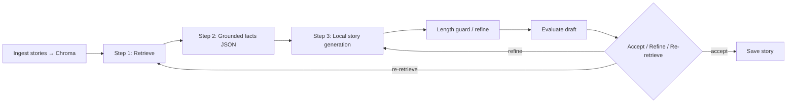

# Project Journey: StoryForge-RAG

I built **StoryForge-RAG** around one question:

**Can I ship an end-to-end pipeline that turns book/story sources into grounded, evaluated narratives—with honest quality limits on consumer GPU hardware?**

This document explains how the system evolved: what I tried, what broke, what I fixed, and where it stands today.

I used AI assistants for research and debugging speed; architecture and implementation decisions are mine.

---

## Current system (2026)

The public repo (`src/storyforge/`) runs a **grounded 3-step RAG** pipeline plus an optional **agentic loop**. Story length is controlled by one request/config target (`length`), not by three independent knobs that used to disagree.

```mermaid
flowchart LR
    ingest["Ingest stories → Chroma"] --> s1["Step 1: Retrieve"]
    s1 --> s2["Step 2: Grounded facts JSON"]
    s2 --> s3["Step 3: Local story generation"]
    s3 --> guard["Length guard / refine"]
    guard --> eval["Evaluate draft"]
    eval --> decide{"Accept / Refine / Re-retrieve"}
    decide -->|refine| s3
    decide -->|re-retrieve| s1
    decide -->|accept| out["Save story"]
```

| Stage | What it does | Typical model |
|--------|----------------|----------------|
| **Step 1** | Chroma search + hybrid BM25 + optional rerank; diverse story titles | `BAAI/bge-base-en-v1.5` embeddings |
| **Step 2** | Extract grounded facts (JSON with chunk ids) | HF router `Qwen/Qwen3-8B` (API); Ollama fallback |
| **Step 3** | Write a fixed **5-section** story from facts only, sized by `length` | Ollama `qwen3.5:9b` (also vLLM / Transformers) |
| **Length profile** | One target drives prompt guidance, token budget, and accept gate | `src/storyforge/rag/length_profile.py` |
| **Agentic loop** | Score each draft; refine incomplete stories or widen retrieval | HF eval 7B → Gemini fallback (or local model, `Evaluation_mode: "local"`) |

**Orchestrator steps:** prepare story JSON → reset/ingest Chroma → `4_generate_story_3step` or `4_generate_story_agentic` (when `Agentic_loop_enabled`).

**Length on generate requests:** pass `length` as a preset (`short` / `medium` / `long` / `epic`), a narration duration (`"13min"`), or a word count (`"1800"`). Omit it and the mode default applies (`fast` → short, `thinking` → long). `mode` selects sampling / thinking; `length` selects how much prose to write.

---

## Evolution: from three layers to grounded RAG

### Earlier approach (v1 narrative)

I first shipped a **multi-layer** path: 5W1H extraction → sectioned summary per `flow_structure.yaml` → multi-pass expansion. It produced longer text but often **lost facts** between layers and repeated beats across sections.

### Pivot: grounded single-pass

I replaced that chain with:

1. Retrieve relevant chunks.
2. Extract **attributable facts** (must cite `source_chunk_ids`).
3. Generate **once** from a bullet list of facts—not from a lossy intermediate summary.

Prompt contracts live in `prompts.yaml` (`grounded_facts_*`, `grounded_story_*`, `grounded_story_refine_*`).

### Latest: agentic loop + length target

Short stories were stable; **long-form (~1,200–2,200 words)** exposed new failure modes (early stop at section 3, prompt leakage, broken dialogue quotes, loop choosing re-retrieve instead of refine, and — most importantly — output stuck at ~450 words even when token budgets were large).

I added `agentic_loop.py`:

- **REFINE** when the draft is incomplete but grounding is good (finish sections, don’t restart retrieval).
- **RE_RETRIEVE** only when faithfulness is low or facts are empty/thin.
- **ACCEPT** when rubric average and completeness heuristics pass.

Then I fixed the real length ceiling: the prompt still said “prefer 3–6 sentences per section,” so the model did exactly that and stopped. Raising `Single_pass_*_max_tokens` alone changed nothing. The fix was a single **length profile** that keeps prompt guidance, token budget, and accept gate in sync (see session below).

Post-save cleanup in `generative_ai.clean_story_output()` fixes common formatting artifacts (unclosed quotes, instruction leakage before `[SECTION 1]`, duplicate words).

---

## Architecture modules

| Module | Role |
|--------|------|
| `storyforge/book_search/` | Archive.org download, text extraction |
| `storyforge/data/` | `story_json` workflow, HF summarization helpers |
| `storyforge/vector_store/` | Chroma + ingest with BGE-aligned embeddings |
| `storyforge/rag/retrieval.py` | Step 1: Chroma + hybrid BM25 + reranker |
| `storyforge/rag/extraction.py` | Step 2: HF API grounded facts, local fallback |
| `storyforge/rag/generation.py` | Step 3: Ollama / vLLM / Transformers story generation |
| `storyforge/rag/length_profile.py` | Resolve `length` → prompt + tokens + accept gate |
| `storyforge/rag/langchain_rag.py` | 3-step orchestrator + length guard |
| `storyforge/rag/agentic_loop.py` | Evaluate → REFINE / RE_RETRIEVE / ACCEPT |
| `storyforge/rag/attribution.py` | Grounded-facts parsing, attribution gate |
| `storyforge/rag/generation_backend.py` | Ollama / vLLM loaders, `build_chat_openai`, `strip_thinking_tags` |
| `storyforge/evaluation/` | HF → Gemini, or local Transformers (`Evaluation_mode: "local"`) |
| `storyforge/orchestrator/` + `api/` | Pipeline steps, FastAPI routes, SSE stream |

Lazy imports in `rag/__init__.py` keep unit tests runnable without loading Transformers on import.

---

## What failed (and what fixed it)

### Retrieval and scale

- **Symptom:** Wrong story in context when multiple tales appeared in one retrieval batch.
- **Mitigation:** Diverse title selection, reranker, entity-biased query reformulation on re-retrieve; grow `data/stories` + re-ingest after embedding model changes.

### Grounding and attribution

- **Symptom:** Names and events not in source chunks.
- **Mitigation:** Strict Step 2 JSON schema; generation prompts forbid new named entities; attribution gate now **log-only** by default (heuristic NER was truncating good stories).

### Evaluation blocking the loop

- **Symptom:** HF `hf-inference` returned 400 for 7B judge; Gemini 503 stalled retries.
- **Mitigation:** Route HF eval through `InferenceClient.chat_completion`; fall back to Gemini on **any** HF failure.

### Long-form generation

- **Symptom:** Incomplete 5-section stories, `accepted: false` despite high scores, dialogue/quote formatting bugs, and drafts stuck at ~450 words even with `Single_pass_fast_max_tokens: 3200`.
- **Root cause (later found):** Prompt wording (`prefer 3–6 sentences per section`) and accept-gate minima lived separately from the token budget. Raising only the budget left the model obeying a short prompt and the loop accepting a short draft.
- **Mitigation (v1):** Higher token floors, refine prompts, `decide_action` prefers REFINE over RE_RETRIEVE for incomplete grounded drafts.
- **Mitigation (current):** Unified `LengthProfile` — one `length` target derives prompt `{length_guidance}`, `max_new_tokens`, `min_words`, and `min_sentences_per_section`. Removed hand-tuned `Min_sentences_per_section` / `Agentic_loop_min_words*` from config so they cannot silently contradict the target. Also raised `Story_generation_n_results` (10) and `HF_grounded_facts_max_new_tokens` (1600) so long prose has enough grounded material instead of padding.

### Honest quality tiers (local GPU)

| Tier | Target | How to request | Status |
|------|--------|----------------|--------|
| **Short** (~450 words / ~3 min) | Single-pass | `mode: "fast"` or `length: "short"` | **Works reliably** |
| **Medium** (~900 words / ~6 min) | Single-pass or agentic | `length: "medium"` | **Usable** |
| **Long (Level B)** (~1,500 words / ~11 min) | Agentic + refine | `mode: "thinking"` or `length: "long"` / `"13min"` | **Improving** — length gates now agree; empty thinking drafts retry automatically with fast sampling |
| **Epic (Level C)** (~2,200 words / ~16 min) | Agentic + richer retrieval | `length: "epic"` | **Experimental** — latency grows; thin facts risk repetition |

On consumer 16 GB VRAM with Ollama, the ceiling is less about OOM and more about wall-clock time + empty thinking-mode responses that strip to `0` words before refine.

---

## Key technical decisions

- **Embeddings:** `BGE-base-en-v1.5` with query prefix at search time; passage prefix at ingest (must re-ingest after model change).
- **Generation:** Ollama `qwen3.5:9b` by default (warm model outside the Python process); Transformers / vLLM still supported via `Generation_provider`.
- **Facts extraction:** HF API (`Qwen/Qwen3-8B`) so Step 2 does not compete with Step 3 for VRAM; local Ollama fallback when HF returns 502 / rate limits.
- **Length:** One derived profile beats three hand-tuned knobs. Presets live in `Story_length_presets`; requests override with `length`.
- **Config:** Secrets in `setup.yaml` (gitignored); template in `setup.example.yaml`. Config and prompts are cached — restart the API after edits.
- **Tests:** Pure decision tests for agentic loop + length profile; lightweight pytest without GPU.

---

## What this demonstrates

- End-to-end **RAG product shape**: ingest → retrieve → ground → generate → evaluate.
- **Failure-aware engineering**: rate limits, OOM, bad retrieval, API route mismatches, loop policy bugs.
- **Iterative evidence**: debug runs, saved outputs under `data/outputs/`, config-driven prompts.
- **API-first** delivery via FastAPI (`/orchestration`, `/create-eval`, vector store routes).

---

## Scope and boundaries

- Manual curation of `data/story_json` and ingest manifests is intentional for controlled demos.
- Evaluation is rubric-based LLM scoring—not human literary judgment.
- I share **strengths and limits** openly for job-search review; the system is a learning vehicle, not a finished product.

---

## Session: Ollama Docker migration + hardening (2026)

This session migrated Step 3 generation from bare Transformers to **Ollama in Docker**, fixed a set of accumulated technical debt items, and added the planned upgrade features.

### Motivation

Running `AutoModelForCausalLM` inside the Python process meant:
- Model cold-start on every API restart (~20 s for 7B).
- VRAM fully consumed by the Python process; no easy warm-swap of model variants.
- No streaming — the full story had to complete before the API returned.

Ollama in Docker solves all three: model stays warm, Ollama manages GPU memory outside the process, and `ChatOllama.astream` enables per-token streaming.

### Fixes applied

**Security:** Three API keys found hardcoded in `setup.yaml` were blanked and user was instructed to rotate them. `secrets.py` now consolidates all HF token env-var aliases (`STORYFORGE_HF_API_KEY`, `HUGGINGFACEHUB_API_TOKEN`, `HUGGINGFACE_API_KEY`, `HF_TOKEN`) into a single `facehugging_api` config key.

**Model name bugs:** `Gemini_evaluation_model` pointed at the non-existent `"gemini-3-flash-preview"`; corrected to `"gemini-2.0-flash"` in both `setup.yaml` and `setup.example.yaml`. HF fallback model in `_hf_chat_extract_json` was set to the Ollama tag `"qwen3.5:9b"` instead of a valid HF repo ID.

**Qwen3.5 thinking tags:** `qwen3.5:9b` can emit `<think>...</think>` blocks before the response. Added `strip_thinking_tags()` in `generation_backend.py` (defensive strip even when `think=False`) and the `think=` parameter to `ChatOllama`.

**repeat_penalty placement:** Moved from top-level `ChatOllama` kwargs (rejected in newer langchain-ollama) into `options={"repeat_penalty": ...}`.

**Module-level globals in evaluation.py:** Six process-wide globals (`evaluation_provider_priority`, `hf_evaluation_model`, etc.) broke test isolation. Replaced with per-call `_cfg()` reads; tests now monkeypatch `_cfg` directly.

### New features shipped

**Hybrid BM25 + dense retrieval:** `rag/retrieval.py` fuses Chroma dense results with a BM25 pass over the same candidate pool using Reciprocal Rank Fusion. Controlled by `Hybrid_search_enabled` and `Hybrid_bm25_weight` in `setup.yaml`. Captures exact name/keyword matches that vector similarity misses.

**Metadata filtering:** `retrieve_docs` now accepts `filter_metadata` (a Chroma `where` filter), enabling targeted series- or story-type-scoped retrieval.

**`langchain_rag.py` split:** The 971-line monolith was split into three focused modules — `retrieval.py`, `extraction.py`, `generation.py` — plus a thin orchestrator. `agentic_loop.py` imports continue to resolve via re-exports in `langchain_rag.py` with no changes to the caller.

**Streaming endpoint:** `POST /orchestration/generate_stream` returns Server-Sent Events. Steps 1–2 run in a thread, Step 3 streams tokens from Ollama via `ChatOllama.astream`. Contract tests in `tests/test_api_contracts.py` run with zero external dependencies.

**Context window expansion:** `Model_max_prompt_tokens: 12288`. Token floors remain (`Single_pass_fast_max_tokens: 3200`, `Single_pass_thinking_max_tokens: 4000`) but the **effective** budget is now max(floor, length-derived) capped by `Story_length_max_new_tokens_cap`.

**Step 2 model upgrade:** `HF_grounded_facts_model: "Qwen/Qwen3-8B"` — better JSON extraction than the previous 7B instruct model, still API-only (no VRAM cost).

**Structured JSON output for Step 2:** `HF_grounded_facts_json_mode: true` in `setup.yaml`. `_hf_chat_extract_json` passes `response_format={"type": "json_object"}` to the HF `InferenceClient`, constraining Qwen3-8B to valid JSON at the token level. Falls back gracefully (retry without flag + warning) if the backend doesn't support it. The `repair_json()` call in `attribution.py` is kept as a safety net for the local-fallback path. Tests in `tests/test_extraction.py`.

**Test suite consolidation:** three micro-files absorbed into larger homes — `test_prompt_contracts.py` → `test_config.py`; `test_generation_backend.py` + `test_story_cleanup.py` → `test_rag_utils.py`.

---

## Session: unified story-length target (2026)

This session fixed the “why won’t my story grow past ~450 words?” failure that token-budget tuning alone could not solve.

### Diagnosis

A ~10–15 minute narration script needs roughly 1,300–2,250 words. Observed drafts were ~450 words even with `Single_pass_fast_max_tokens: 3200` (room for ~2,200+ words of output). The model was obeying the prompt:

- “Prefer 3–6 sentences per section”
- “EACH section MUST contain at least 3 complete sentences”

Five sections × ~4–5 sentences × ~15–20 words ≈ **400–500 words**, regardless of token headroom. The agentic accept gate (`Agentic_loop_min_words*`) also only required a short story to pass.

### Design

Introduce one `LengthProfile` that derives:

| Derived field | Used by |
|---------------|---------|
| `guidance_text()` → `{length_guidance}` | `prompts.yaml` story + refine templates |
| `max_new_tokens` | Ollama / vLLM / Transformers generation |
| `min_words` | Agentic completeness gate |
| `min_sentences_per_section` | Completeness gate + 3-step length guard |

Resolution order for a request: explicit `length` → mode default (`Story_length_default_fast` / `_thinking`) → fallback preset.

Accepted `length` forms: preset name, `"12min"` (words = minutes × `Story_length_words_per_minute`), or an integer / numeric string word count.

### Changes shipped

- New module: `src/storyforge/rag/length_profile.py`
- Prompts: replace hardcoded sentence ranges with `{length_guidance}`
- Config: `Story_length_presets`, defaults, WPM, token cap; remove hand-tuned `Min_sentences_per_section` / `Agentic_loop_min_words*`
- Wire `length` through generation, 3-step orchestrator, agentic loop, orchestrator helpers, and API request models (`/create-eval/story_generate`, `/orchestration/run_step`, `/run_pipeline`, `/generate_stream`)
- Shared `build_story_prompt` / `build_refine_prompt` so streaming cannot drift from non-streaming
- Companion knobs for long prose: `Story_generation_n_results: 10`, `HF_grounded_facts_max_new_tokens: 1600`
- Tests: `tests/test_length_profile.py` + updated prompt/config contracts

### Remaining open issue (resolved — see the empty-draft recovery session below)

Thinking mode could return an empty body (budget spent inside `<think>`). That path now retries once with fast sampling and raises a clear `RuntimeError` if both attempts are empty; the length-guard refine falls back to the pre-refine draft. Prefer `mode: "fast"` + `length: "13min"` when you want the most reliable long target.

### Architecture modules (current)

| Module | Role |
|--------|------|
| `storyforge/book_search/` | Archive.org download, text extraction |
| `storyforge/data/` | `story_json` workflow, HF summarization helpers |
| `storyforge/vector_store/` | Chroma + ingest with BGE-aligned embeddings |
| `storyforge/rag/retrieval.py` | Step 1: Chroma + hybrid BM25 + reranker |
| `storyforge/rag/extraction.py` | Step 2: HF API grounded facts, local fallback |
| `storyforge/rag/generation.py` | Step 3: Ollama / vLLM / Transformers story generation |
| `storyforge/rag/length_profile.py` | Resolve `length` → prompt + tokens + accept gate |
| `storyforge/rag/langchain_rag.py` | 3-step orchestrator + length guard |
| `storyforge/rag/agentic_loop.py` | Evaluate → REFINE / RE_RETRIEVE / ACCEPT |
| `storyforge/rag/attribution.py` | Grounded-facts parsing, attribution gate |
| `storyforge/rag/generation_backend.py` | `load_ollama_llm`, `build_chat_openai`, `strip_thinking_tags`, vLLM |
| `storyforge/evaluation/` | HF → Gemini, or local Transformers (`Evaluation_mode: "local"`) |
| `storyforge/orchestrator/` + `api/` | Pipeline steps, FastAPI routes, SSE stream |

---

## Session: vLLM backend, empty-draft recovery, structural cleanup, local evaluation (2026)

This session had two parts: closing out the roadmap's remaining high-value items, and a
structure pass to remove drift and dead code accumulated across earlier sessions.

### vLLM as a second generation backend

Added `generation_backend.py: load_vllm_llm()` (a `langchain_openai.ChatOpenAI` client
against a local OpenAI-compatible vLLM server) alongside the existing Ollama path.
`generation_provider(cfg)` now resolves `ollama` / `vllm` / `transformers` from
`Generation_provider`, and `generation.py`'s `_load_generation_llm()` dispatches on it
before falling through to Ollama. Useful for concurrent/batched generation; for a single
local user, Ollama remains the simpler default.

### Empty-draft recovery

Thinking mode occasionally returned a fully empty draft (the model spent its whole budget
inside `<think>...</think>`, which `strip_thinking_tags()` then strips to nothing).
`generate_from_facts()` now retries once with `mode="fast"` sampling before giving up, and
raises a clear `RuntimeError` (rather than returning `""`) if that retry is also empty. The
length-guard refine pass in `langchain_rag.py` catches that `RuntimeError` and falls back to
the original (pre-refine) draft instead of losing the story entirely. This closed the
"remaining open issue" from the previous session.

**Follow-up gap, caught in review:** the first pass only wired this into the 3-step length
guard — `agentic_loop.py`'s `run_agentic_story_loop()` called `generate_from_facts()` with no
`try/except` at all, so a `RuntimeError` on iteration 2+ still aborted the whole loop and
discarded every earlier iteration's `best` draft, propagating up as a generic `success: false`
with no draft attached. The loop now catches `RuntimeError` per iteration, records a
`generation_failed` entry in `iterations` for visibility, and stops with the best draft seen
so far (`stop_reason: "generation_failed_using_best_so_far"`) — or a clear empty result with
`stop_reason: "generation_failed"` if it happens on the very first iteration, when there's no
prior draft to fall back to. Tests in `tests/test_agentic_loop.py`.

### Structural cleanup

A pass through the whole `src/storyforge/` tree against an earlier internal audit
(`StoryForge_pattern_audit.md`) found most high-severity findings already fixed in prior
sessions. What was still live:

- Removed ~90 lines of dead code in `book_search/fetch_book.py`
  (`download_archive_book_and_save_meta` was never called anywhere — the live download
  flow was reimplemented separately in `orchestrator/response_parameter.py`).
- `_split_section_bodies` / `_sentence_count` / `_SECTION_HEADER_RE` were independently
  defined in both `generation.py` and `agentic_loop.py` — the exact "duplicated logic that
  drifts" pattern the audit called out. Consolidated into `length_profile.py` as the single
  shared source.
- The vLLM `ChatOpenAI` client was being built inline in `orchestration_routes.py`,
  duplicating `load_vllm_llm()`'s guts. Extracted a shared `build_chat_openai()` so the
  streaming and non-streaming paths can't drift the way the Ollama client once did.
- Aligned divergent hardcoded defaults (`Chroma_path`, `Story_input`) that only worked
  because `setup.yaml` happened to set them explicitly — an omitted key would have silently
  pointed ingest and retrieval at different directories.
- Fixed `secrets.py` resolving `.env` relative to its own file location instead of the repo
  root (every other module uses the repo-root convention).
- `orchestrator.run_pipeline` hardcoded `formats=["pdf", "epub"]` for step 0, making the
  configured `Download_formats` key unreachable — now reads it from config.
- Removed the dead `Prompts_file` config key (declared in both YAMLs, read nowhere).
- Added the missing `vLLM_base_url` / `vLLM_model` keys to the real `setup.yaml`, and the
  missing `Generated_story_output` / `Generated_summary_output` / `Evaluated_stories_output`
  keys to `setup.example.yaml` so a fresh clone matches the real output layout.

### Local evaluation model

Added `Evaluation_mode: "local"` as a third path alongside the existing HF/Gemini API
chain. `evaluate_model()` checks it first and, when set, short-circuits straight to a local
evaluator descriptor instead of racing through `Evaluation_provider_priority`.
`_invoke_local_once()` loads a small causal LM (`Local_evaluation_model`, default
`Qwen/Qwen2.5-3B-Instruct`) via Transformers, cached by `(model_id, device)` so it loads
once per server process and is reused across every agentic-loop iteration afterward. If the
local model fails for any reason (OOM, missing weights), `_invoke_local_with_fallback()`
catches it and retries through the normal HF → Gemini chain rather than failing the loop.

`Local_evaluation_device` defaults to `"cpu"` deliberately — loading a second model on
`"cuda"` alongside Ollama's own CUDA context has been observed to starve VRAM on a 16 GB
card (see the `Reranker_device` note in `setup.yaml`). This removes one full external API
round-trip (extraction already uses one) from every agentic-loop iteration when enabled.

---

## What I am doing next

1. Fix the BGE passage-prefix convention (currently prefixed like a query at ingest; the documented recipe only prefixes queries) and re-embed the corpus.
2. More ingest diversity and chunk-quality checks (retrieval is still the ceiling) — see [`DATA_PREP.md`](./DATA_PREP.md).
3. Tune long-form (`length: "long"` / `"13min"`) until Level B accepts consistently under agentic loop.
4. Stronger retrieval eval harness (precision@k on fixed query set).
5. Optional epic / Level C only after stable wall-clock and non-empty generation under Ollama.
6. Optionally post-process streamed stories with the attribution gate (streaming still skips it by design today).

---

## Repo and docs

- **Code:** https://github.com/Nix-ml-journey/StoryForge-RAG  
- **Overview:** `docs/README.md`  
- **Data prep after extract:** `docs/DATA_PREP.md`  
- **Quick test path:** `docs/QUICK_DEMO.md`  
- **Roadmap:** `docs/PROJECT_UPDATE_ROADMAP.md`, `docs/UPGRADE_ROADMAP_5060Ti.md`
