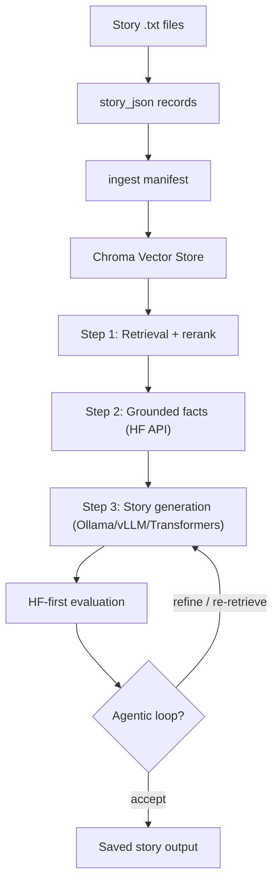

# StoryForge-RAG

StoryForge-RAG is an end-to-end AI pipeline for story ingestion, vector search (Chroma), grounded story generation, and automated evaluation via FastAPI.

Built as a practical AI/data engineering project: system design, model trade-offs, and real-world reliability (rate limits, OOM, bad retrieval, incomplete generations).

## Architecture



## Reviewer quick path

1. Read [`QUICK_DEMO.md`](./QUICK_DEMO.md) for the no-GPU/no-API-key validation path.
2. Run `python -m pytest`
3. Read [`PROJECT_JOURNEY.md`](./PROJECT_JOURNEY.md) for design decisions and trade-offs.
4. Read [`PRODUCTION_NOTES.md`](./PRODUCTION_NOTES.md) for production boundaries.

Tests use temporary directories and do not require GPU, Chroma data, or live API calls.

## Current model stack

| Stage | Default | Notes |
|-------|---------|-------|
| Embeddings | `BAAI/bge-base-en-v1.5` | 768-dim, local GPU |
| Reranker | `cross-encoder/ms-marco-MiniLM-L-6-v2` | After Chroma, before Step 2 |
| Hybrid search | BM25 + dense (RRF) | Optional via `Hybrid_search_enabled` |
| Step 2 facts | `Qwen/Qwen3-8B` (HF API) | Retry + optional JSON mode |
| Step 3 story | `qwen3.5:9b` (Ollama) | Also supports vLLM or Transformers |
| Evaluation | HF 7B → Gemini fallback | Used by agentic loop |

## Grounded story generation

1. **Step 1 — Retrieval:** Chroma search (+ hybrid BM25 + reranker). Diverse story titles when multiple sources match.
2. **Step 2 — Grounded extraction:** HF API extracts JSON facts from retrieved chunks. Retries on transient API errors.
3. **Step 3 — Generation:** One pass from grounded facts into a 5-section story. Optional refine pass if sections are too short.

If extraction returns no usable facts, generation falls back to retrieval-only mode.

### Story format

- 5 section headers in order (see `prompts.yaml`)
- **At least 3 complete sentences per section** (`Min_sentences_per_section`)
- Grounded in extracted facts — no invented named characters/places
- `mode: "fast"` for shorter output; `mode: "thinking"` / `"medium"` for longer output

### Agentic loop (optional)

When `Agentic_loop_enabled: true`:

- **ACCEPT** when scores + completeness pass
- **REFINE** when draft is incomplete but grounding is good
- **RE_RETRIEVE** when faithfulness is low or facts are thin

## Key config (`setup.example.yaml`)

| Setting | Purpose |
|---------|---------|
| `Generation_provider` | `ollama` (default), `vllm`, or `transformers` |
| `Vector_store_model` | Embedding model (default BGE-base) |
| `Hybrid_search_enabled` | BM25 + dense fusion |
| `HF_grounded_facts_json_mode` | Strict JSON for Step 2 |
| `Min_sentences_per_section` | Minimum sentences per section (default 3) |
| `Generation_fast_*` / `Generation_thinking_*` | Token budgets and sampling |
| `Agentic_loop_*` | Loop thresholds |
| `Host` / `Port` | API bind address |

Copy `setup.example.yaml` → `setup.yaml` for local runs. Secrets stay out of git.

Prompt templates live in `prompts.yaml` under `generation`.

## What it does

- Prepares story records from `.txt` files under `data/stories/`
- Ingests chunks into Chroma with explicit BGE embeddings
- Retrieves relevant context, extracts grounded facts, generates stories
- Evaluates output with rubric scoring (HF first, Gemini fallback)
- Optional book search / PDF-EPUB extraction for public-domain sources

## Tech stack

- Python, FastAPI, Pydantic
- ChromaDB, sentence-transformers
- Ollama / vLLM / Transformers (Step 3)
- Hugging Face Inference API + Gemini fallback

## Project structure

**Public (this repo)**

- `main.py` — FastAPI entry point
- `src/storyforge/` — application package
  - `api/` — `/orchestration`, `/create-eval`, vector store routes
  - `orchestrator/` — pipeline step control
  - `rag/` — retrieval, extraction, generation, agentic loop
  - `vector_store/` — Chroma ingest and query
  - `data/` — story_json workflow
  - `evaluation/` — rubric scoring + retrieval eval
  - `config/` — YAML config + env secret overlay
- `scripts/` — CLI helpers (see [`../scripts/README.md`](../scripts/README.md))
- `tests/` — pytest suite
- `data/*/sample/` — public demo corpus only
- `docs/` — architecture, demo path, roadmaps

**Local only (gitignored)**

- Full corpus: `data/stories/`, `data/story_json/`, `data/ingest/ingest_manifest.jsonl`
- Runtime: `data/chroma_db/`, `data/outputs/`, `setup.yaml`, `.env`

## Quick start

```powershell
docker compose up -d
docker exec -it ollama ollama pull qwen3.5:9b
pip install -r requirements.txt
copy setup.example.yaml setup.yaml   # edit BASE_PATH and keys
python -m pytest
python main.py
```

Open `http://localhost:8000/docs`.

## Main data flow

1. Put story `.txt` files in `data/stories/`
2. `py scripts/step1_prepare_and_enrich.py`
3. `py scripts/records_to_ingest_manifest.py`
4. `py scripts/ingest_manifest.py` (or `reset_and_ingest.py` for a full wipe)
5. Generate via API:
   - `POST /create-eval/story_generate` with `query` and optional `mode`
   - or `POST /orchestration/run_step` with `4_generate_story_3step`

### Chroma maintenance

| Task | Script |
|------|--------|
| Re-embed after editing chunk text | `refresh_chunk_embeddings.py --glob "Author__*"` |
| Push section metadata only | `push_section_metadata.py --glob "Author__*"` |

## Tests

```bash
python -m pytest
```

Covers: config loading, evaluation provider selection, retrieval metrics, agentic loop decisions, prompt contracts, story cleanup, API route contracts.

## Retrieval evaluation

```bash
py scripts/retrieval_eval.py --cases tests/fixtures/retrieval_eval_cases.example.json --k 3
```

Reports top-1 / top-k accuracy and expected fact coverage.

## Current status

The pipeline is functional end-to-end. Active tuning areas:

- Long-form completeness in thinking/medium mode
- Retrieval quality as corpus size grows
- Reducing repetitive phrasing in generated prose

Recent upgrades: BGE explicit ingest, hybrid search, HF extraction retry, Ollama context window (`num_ctx`), section sentence guardrails, and Chroma maintenance scripts.

## Related docs

- [`PROJECT_JOURNEY.md`](./PROJECT_JOURNEY.md) — development story and trade-offs
- [`UPGRADE_ROADMAP_5060Ti.md`](./UPGRADE_ROADMAP_5060Ti.md) — hardware-focused upgrade plan
- [`PRODUCTION_NOTES.md`](./PRODUCTION_NOTES.md) — production boundaries
- [`QUICK_DEMO.md`](./QUICK_DEMO.md) — fast reviewer path

## Security

- Do not commit `setup.yaml`, API keys, Chroma DB, or generated outputs.
- Keep `setup.example.yaml` in sync when adding new config keys.

## License

MIT
