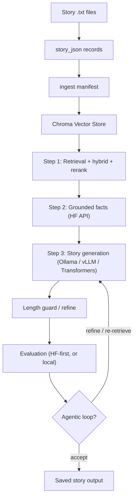

# StoryForge-RAG

StoryForge-RAG is an end-to-end AI pipeline for story ingestion, vector search (Chroma), grounded story generation, and automated evaluation via FastAPI.

Built as a practical AI/data engineering project: system design, model trade-offs, and real-world reliability (rate limits, OOM, bad retrieval, incomplete generations).

## Architecture



## Reviewer quick path

1. Read [`QUICK_DEMO.md`](./QUICK_DEMO.md) for setup and first generate.
2. Read [`DATA_PREP.md`](./DATA_PREP.md) if you care about corpus quality after extract.
3. Run `python -m pytest` (or `.\venv\Scripts\python.exe -m pytest` inside the project venv).
4. Read [`PROJECT_JOURNEY.md`](./PROJECT_JOURNEY.md) for design decisions and trade-offs.
5. Read [`PRODUCTION_NOTES.md`](./PRODUCTION_NOTES.md) for production boundaries.

Tests use temporary directories and do not require GPU, Chroma data, or live API calls.

## Current model stack

| Stage | Default | Notes |
|-------|---------|-------|
| Embeddings | `BAAI/bge-base-en-v1.5` | 768-dim, local GPU |
| Reranker | `cross-encoder/ms-marco-MiniLM-L-6-v2` | After Chroma, before Step 2 |
| Hybrid search | BM25 + dense (RRF) | On via `Hybrid_search_enabled`; needs `rank-bm25` from `requirements.txt` |
| Step 2 facts | `Qwen/Qwen3-8B` (HF API) | Retry + optional JSON mode; local Ollama fallback |
| Step 3 story | `qwen3.5:9b` (Ollama) | Also supports vLLM or Transformers |
| Evaluation | HF 7B → Gemini fallback | Used by the agentic loop; `Evaluation_mode: "local"` runs it in-process instead |

## Grounded story generation

1. **Step 1 — Retrieval:** Chroma search (+ hybrid BM25 + reranker). Diverse story titles when multiple sources match. Chunk count is controlled by `Story_generation_n_results` (default 10).
2. **Step 2 — Grounded extraction:** HF API extracts JSON facts from retrieved chunks. Retries on transient API errors; falls back to local generation (Ollama / vLLM / Transformers, matching `Generation_provider`) if HF is down. Fact-token budget is `HF_grounded_facts_max_new_tokens` (default 1600).
3. **Step 3 — Generation:** One pass from grounded facts into a 5-section story. A length guard may run one refine pass when the draft is too short.

If extraction returns no usable facts, generation falls back to retrieval-only mode -- and the agentic loop will not ACCEPT that draft (it re-retrieves instead), with or without an evaluator.

Offline / no HF credits: set `Grounded_facts_provider: "local"` so Step 2 goes straight to the local model (schema-constrained JSON on Ollama, lenient parsing, citation check against retrieved chunk ids, one compact retry). See [`DATA_PREP.md`](./DATA_PREP.md#offline-no-hf-credits).

### Story format

- 5 section headers in order (see `prompts.yaml`)
- Grounded in extracted facts — no invented named characters / places
- Per-section sentence and word minimums come from the **length target** (below)
- `mode` selects sampling / thinking; `length` selects how much prose to write

### Story length

One target drives the three things that must agree, or output never grows:

1. the prompt's words / sentences-per-section instruction
2. the generation token budget
3. the accept gate (minimum words + minimum sentences per section)

They are all derived in `src/storyforge/rag/length_profile.py` from a single word target, so raising tokens alone can no longer leave the model stuck at ~450 words.

Pass `length` on a generate request as any of:

| `length` | Meaning | Approx. narration |
|----------|---------|-------------------|
| `"short"` | 450 words | ~3 min |
| `"medium"` | 900 words | ~6 min |
| `"long"` | 1500 words | ~11 min |
| `"epic"` | 2200 words | ~16 min |
| `"12min"` | sized at `Story_length_words_per_minute` (default 140) | 12 min |
| `"1800"` | explicit word count | ~13 min |

Omit `length` and the default for the mode applies:

| `mode` | Default length |
|--------|----------------|
| `fast` | `Story_length_default_fast` → `short` |
| `thinking` / `medium` | `Story_length_default_thinking` → `long` |

`mode` still controls sampling and Ollama thinking; `length` decides how much prose gets written.

### Agentic loop (optional)

When `Agentic_loop_enabled: true`:

- **ACCEPT** when scores + completeness pass (completeness uses the resolved length target)
- **REFINE** when the draft is incomplete but grounding is good
- **RE_RETRIEVE** when faithfulness is low or facts are thin

Minimum word count and minimum sentences per section are **no longer hardcoded** in config. They come from the length profile.

## Generate API examples

### Create-eval (recommended)

```bash
# Short / fast draft
curl -s -X POST http://localhost:8000/create-eval/story_generate \
  -H "Content-Type: application/json" \
  -d '{
    "query": "A scholar discovers something in an old house that he shouldn'\''t have",
    "generation_type": "full_story",
    "save": true,
    "mode": "fast",
    "story_type": "mix"
  }'

# ~13-minute narration target (thinking mode)
curl -s -X POST http://localhost:8000/create-eval/story_generate \
  -H "Content-Type: application/json" \
  -d '{
    "query": "A scholar discovers something in an old house that he shouldn'\''t have",
    "generation_type": "full_story",
    "save": true,
    "mode": "thinking",
    "length": "13min",
    "story_type": "mix"
  }'
```

### Orchestration step

```bash
curl -s -X POST http://localhost:8000/orchestration/run_step \
  -H "Content-Type: application/json" \
  -d '{
    "step": "4_generate_story_3step",
    "title": "Amun Chronicles",
    "mode": "thinking",
    "length": "long"
  }'
```

### Streaming (SSE)

```bash
curl -N http://localhost:8000/orchestration/generate_stream \
  -X POST -H "Content-Type: application/json" \
  -d '{
    "query": "A warrior monk faces his greatest trial",
    "mode": "fast",
    "length": "medium"
  }'
```

Streaming uses the same length guidance in the prompt. It cannot retry mid-stream and does not run the attribution gate, so length enforcement and attribution after generation are non-streaming / agentic-loop concerns.

## Key config (`setup.example.yaml`)

| Setting | Purpose |
|---------|---------|
| `Generation_provider` | `ollama` (default), `vllm`, or `transformers` |
| `Vector_store_model` | Embedding model (default BGE-base) |
| `Story_generation_n_results` | Chunks passed to Step 2 (default 10) |
| `Story_generation_rerank_top_n` | Keep ≥ `Story_generation_n_results` |
| `HF_grounded_facts_json_mode` | Strict JSON for Step 2 |
| `HF_grounded_facts_max_new_tokens` | Fact-list token budget (default 1600) |
| `Story_length_presets` | Named length targets (name → word count) |
| `Story_length_default_fast` / `_thinking` | Default target per mode |
| `Story_length_words_per_minute` | Pace for `"Nmin"` targets (default 140) |
| `Story_length_max_new_tokens_cap` | Hard ceiling on generation tokens |
| `Generation_fast_*` / `Generation_thinking_*` | Sampling + token floors |
| `Generation_repetition_penalty` | Anti-loop decoding |
| `Agentic_loop_*` | Loop thresholds (scores / re-retrieve / refine boost) |
| `Evaluation_mode` | `api` (default, HF → Gemini) or `local` (in-process, no per-iteration API round-trip) |
| `Local_evaluation_model` / `_device` | Local judge model (default `Qwen/Qwen2.5-3B-Instruct` on CPU) |
| `Generated_story_output` / `Evaluated_stories_output` | Output folders under `data/outputs/` |
| `Host` / `Port` | API bind address |

Copy `setup.example.yaml` → `setup.yaml` for local runs. Secrets stay out of git.

Prompt templates live in `prompts.yaml` under `generation`. Story / refine prompts inject `{length_guidance}` from the resolved length profile — they do **not** hardcode `"3-6 sentences per section"`.

## What it does

- Prepares story records from `.txt` files under `data/stories/`
- Ingests chunks into Chroma with explicit BGE embeddings
- Retrieves relevant context, extracts grounded facts, generates stories
- Enforces a configurable length target across prompt, tokens, and accept gate
- Retries empty thinking-mode drafts once with fast sampling; length-guard refine falls back to the pre-refine draft
- Evaluates output with rubric scoring (HF → Gemini, or `Evaluation_mode: "local"`)
- Optional book search / PDF-EPUB extraction for public-domain sources

## Tech stack

- Python, FastAPI, Pydantic
- ChromaDB, sentence-transformers
- Ollama / vLLM / Transformers (Step 3)
- Hugging Face Inference API + Gemini fallback (optional local eval model)

## Project structure

**Public (this repo)**

- `main.py` — FastAPI entry point
- `src/storyforge/` — application package
  - `api/` — `/orchestration`, `/create-eval`, vector store routes
  - `orchestrator/` — pipeline step control
  - `rag/` — retrieval, extraction, generation, length profile, agentic loop
  - `vector_store/` — Chroma ingest and query
  - `data/` — story_json workflow
  - `evaluation/` — rubric scoring + retrieval eval
  - `config/` — YAML config + env secret overlay
- `scripts/` — CLI helpers (see [`../scripts/README.md`](../scripts/README.md))
- `tests/` — pytest suite (includes `test_length_profile.py`)
- `data/*/sample/` — public demo corpus only
- `docs/` — architecture, demo path, roadmaps

**Local only (gitignored)**

- Full corpus: `data/stories/`, `data/story_json/`, `data/ingest/ingest_manifest.jsonl`
- Runtime: `data/chroma_db/`, `data/outputs/`, `setup.yaml`, `.env`

## Quick start

```powershell
docker compose up -d
docker exec -it ollama ollama pull qwen3.5:9b
pip install -r requirements.txt
copy setup.example.yaml setup.yaml   # edit BASE_PATH and keys
python -m pytest
python main.py
```

Open `http://localhost:8000/docs`.

After changing `setup.yaml` or `prompts.yaml`, restart `python main.py` — config and prompts are cached.

## Main data flow

Extracted books in `data/raw_extracted/` are **not** ingest-ready. Clean, split (one story per file), then:

1. Put cleaned story `.txt` files in `data/stories/`
2. `py scripts/step1_prepare_and_enrich.py`
3. Review `data/story_json/*.json` (author/title, chunks, section tags)
4. `py scripts/records_to_ingest_manifest.py`
5. `py scripts/ingest_manifest.py` (or `reset_and_ingest.py` for a full wipe -- it also uses `story_json` when present: reviewed chunks, section tags, Author / Summary / Display_title)
6. Generate via API:
   - `POST /create-eval/story_generate` with `query`, optional `mode`, optional `length`
   - or `POST /orchestration/run_step` with `4_generate_story_3step` / `4_generate_story_agentic`

See [`DATA_PREP.md`](./DATA_PREP.md) for the post-extract quality checklist.

### Chroma maintenance

| Task | Script |
|------|--------|
| Re-embed after editing chunk text | `refresh_chunk_embeddings.py --glob "Author__*"` |
| Push section metadata only | `push_section_metadata.py --glob "Author__*"` |
| Check what landed (coverage %, missing Author/Summary, bad Title/chunk_id) | `validate_chroma_metadata.py` |

## Tests

```bash
python -m pytest
```

Covers: config loading, length-profile resolution, evaluation provider selection (including `Evaluation_mode: "local"`), empty-draft recovery (`tests/test_empty_draft_recovery.py` + agentic failure paths in `tests/test_agentic_loop.py`), retrieval metrics, agentic loop decisions, prompt contracts, story cleanup, API route contracts.

## Retrieval evaluation

```bash
py scripts/retrieval_eval.py --cases tests/fixtures/retrieval_eval_cases.example.json --k 3
```

Reports top-1 / top-k accuracy and expected fact coverage.

## Current status

The pipeline is functional end-to-end. Active tuning areas:

- Retrieval quality as corpus size grows -- Phase 1 tuning stopped (2026-09) at top1=0.80 / top3=0.90 / fact_coverage=0.77; remaining misses need query reformulation or corpus/chunking work, not another knob (see docs/PROJECT_JOURNEY.md "What I am doing next" for the case-by-case breakdown and why `Hybrid_bm25_weight` is currently a no-op with reranking on)
- Phase 2 generation reliability -- length targets are fine under agentic `long` (first batch: under-min-words 0.0); active issue is grounded-facts extraction / HF credits masking accept rate. Offline fixes landed (2026-09): no-eval path never ACCEPTs with zero facts (iterations record `has_eval`), hardened local facts provider (`Grounded_facts_provider: "local"`), and `reset_and_ingest.py` now reads story_json metadata; the clean scored re-measure waits for HF credits. Measurement: `scripts/measure_generation_length.py`. Details in docs/PROJECT_JOURNEY.md
- Reducing repetitive phrasing in generated prose
- Retrieval eval fixture (`tests/fixtures/retrieval_eval_cases.example.json`) now has 30 realistic cases incl. "wrong book" traps; `scripts/retrieval_eval.py` was fixed (2026-09) to route through the real hybrid+rerank `retrieve_docs()` pipeline instead of a bare dense-only Chroma query it was silently using before -- use it before/after any retrieval tuning

Recent upgrades: `rank-bm25` promoted from optional to required in `requirements.txt` (2026-09; without it, hybrid BM25 fusion was silently skipped), reranked before diversity selection in `retrieve_docs()` instead of after (2026-09; the cross-encoder now scores the full hybrid-fused pool before diversity narrows it to a few titles, not the other way around -- see docs/PROJECT_JOURNEY.md for the retrieval_eval cases this targets and the exact re-measure command), fixed the BGE passage-prefix convention (ingest no longer prefixes passages -- only queries carry the instruction prefix, per BGE's documented recipe; **re-ingest required**, see docs/DATA_PREP.md), BGE explicit ingest, hybrid search, HF extraction retry / `/no_think` + raised `HF_grounded_facts_max_new_tokens`, Ollama context window (`num_ctx`), unified story-length target (`length` / presets / `Nmin`), shared prompt builders for streaming + non-streaming, section length guardrails, Chroma maintenance scripts, a vLLM generation backend, empty-draft recovery (thinking → fast retry → clear error; length-guard and agentic loop both fall back gracefully), Phase 2 length measurement script (`scripts/measure_generation_length.py`), and an optional local evaluation model (`Evaluation_mode: "local"`) that removes the HF/Gemini round-trip from the agentic loop.

## Related docs

- [`DATA_PREP.md`](./DATA_PREP.md) — after extract: clean, split, review JSON, then ingest
- [`PROJECT_JOURNEY.md`](./PROJECT_JOURNEY.md) — development story and trade-offs
- [`UPGRADE_ROADMAP_5060Ti.md`](./UPGRADE_ROADMAP_5060Ti.md) — hardware-focused upgrade plan
- [`PRODUCTION_NOTES.md`](./PRODUCTION_NOTES.md) — production boundaries
- [`QUICK_DEMO.md`](./QUICK_DEMO.md) — how to use / fast path
- [`../StoryForge_pattern_audit.md`](../StoryForge_pattern_audit.md) — historical bug audit (read the banner first)
- Root [`../README.md`](../README.md) — short overview that points here

## Security

- Do not commit `setup.yaml`, API keys, Chroma DB, or generated outputs.
- Keep `setup.example.yaml` in sync when adding new config keys.

## License

MIT
